# Red Hat OpenShift Service Mesh Control Plane Lab

Use the Red Hat OpenShift Service Mesh operator to deploy a multi-tenant Service Mesh

<!-- TOC -->

- [Red Hat OpenShift Service Mesh Control Plane Lab](#red-hat-openshift-service-mesh-control-plane-lab)
  - [Control Plan and Members Roll Configuration](#control-plan-and-members-roll-configuration)
  - [Setup](#setup)
    - [Lab Configuration](#lab-configuration)
    - [Labs Content](#labs-content)
    - [Projects for Control Plane and Demo Apps](#projects-for-control-plane-and-demo-apps)
  - [Create Service Mesh Control Plane](#create-service-mesh-control-plane)
  - [Service Mesh Member Roll](#service-mesh-member-roll)
  - [Next Topic](#next-topic)

<!-- /TOC -->

## Control Plan and Members Roll Configuration

Configure Control Plane including

* Configure Control Plane
* Configure project(s) or namespace(s) to be part of Service Mesh
  
Overall steps including
* Create project for ControlPlane. Normally named istio-system.
  Remark: For this lab will be ${USERID}-istio-system
* Creating and managing a ServiceMeshControlPlane resource to deploy the Service Mesh control plane
* Creating a ServiceMeshMemberRoll resource to specify the namespaces associated with the Service Mesh.

Following command line tools are needed for lab

* OpenShift Command Line Interface (CLI - oc command) 
* cURLs
* git (optional)
  
OpenShift Web Console provided link in the top right of page to download oc command here.

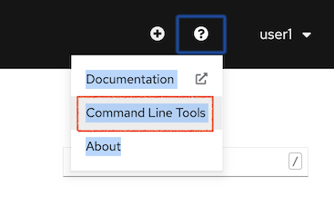

You can  also  download oc tool and cURL for OSX and Windows here => [Link](https://1drv.ms/u/s!ArOxOqm_sB7DiSYninA0Aqd6a-kU?e=zsJMGn)

## Setup

### Lab Configuration

* Setup environment variables
```bash
export USERID=<your user ID> 
```

* For Windows
```bash
set USERID=<your user ID>
```

* Login to OpenShift with oc command by
```bash
oc login --insecure-skip-tls-verify=true --username=$USERID --server=<URL to OpenShift API> --username=${USERID} --password=<password>
```

* For Windows
```bash
oc login --username=%USERID% --server=<URL to OpenShift API> 
```

* Use your browser to open OpenShift Web Admin Console and login with your User ID. To display console URL
```bash
oc whoami --show-console
```

### Labs Content

Clone labs content to your working directory. Open your terminal (For OSX terminal, iTerm2, etc and CMD for Windows) then run following command

Link to lab repository [Service Mesh Workshop](https://gitlab.com/workshop6/service-mesh.git)

```bash
git clone https://gitlab.com/workshop6/service-mesh.git
```

If you don't have git, click this Link =>[Service Mesh Workshop](https://gitlab.com/workshop6/service-mesh)


Download labs content by click following icon.

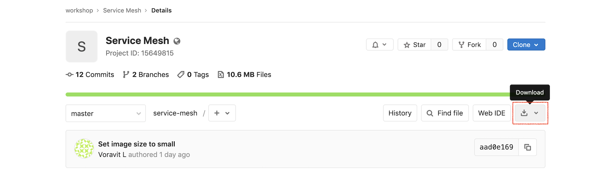

### Projects for Control Plane and Demo Apps

Create projects (namespace) for Service Mesh's control plane and your applications (for testing)

```bash
oc new-project $USERID-istio-system --display-name="$USERID Istio System"
oc new-project $USERID 
#or use following shell script
scripts/create-project.sh
```

You can also use OpenShift Web Admin Console to create Project by select new project from top-left menu then create your project
**Remark: replace user1 with your user ID**

* Control Plane

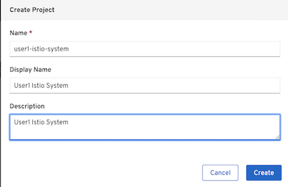

* Demo applications

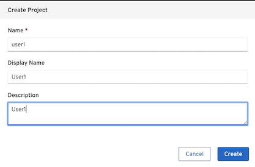


## Create Service Mesh Control Plane

Now that the Service Mesh Operator has been installed, you can now install a Service Mesh control plane.
The previously installed Service Mesh operator watches for a ServiceMeshControlPlane resource in all namespaces. Based on the configurations defined in that ServiceMeshControlPlane, the operator creates the Service Mesh control plane.

In this section of the lab, you define a ServiceMeshControlPlane and apply it to your **$USERID-istio-system namespace**.
 
* Install Control Plane using the custom resource file [basic install](../install/basic-install.yml)
    Mutual TLS is disbled by setting mtls to false.
    Kiali user is single sign-on with OpenShift
* Create the service mesh control plane in the istio-system project from [basic-install.yml](../install/basic-install.yml) by create Service Mesh's CRDs to control plane project.
  
  ```bash
  oc apply -f install/basic-install.yml -n $USERID-istio-system

  #or use following bash script
  scripts/create-control-plane.sh
  ```
  
  By Web Console, navigate to: Operators -> Installed Operators then select Red Hat OpenShift Service Mesh

  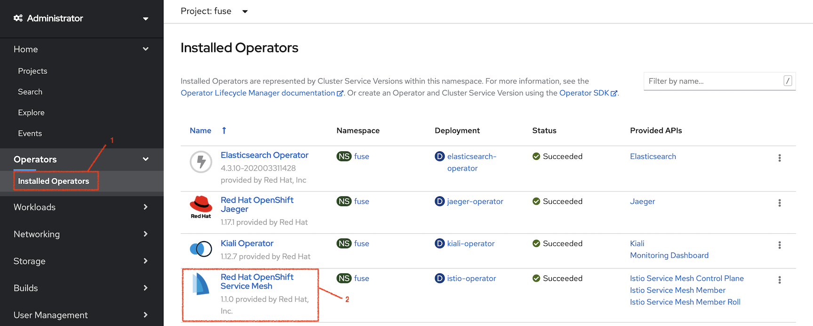

  Select Create Instance under Istio Service Mesh Control Plane

  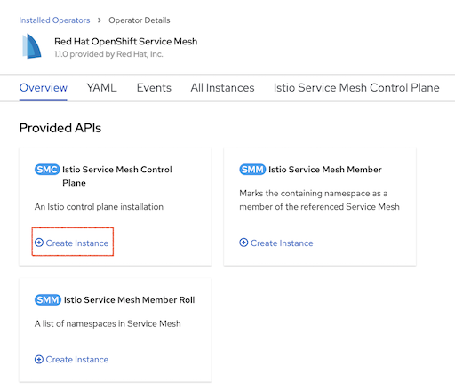

  Copy and paste custom resource file [basic install](../install/basic-install.yml) to YAML section then click Create

  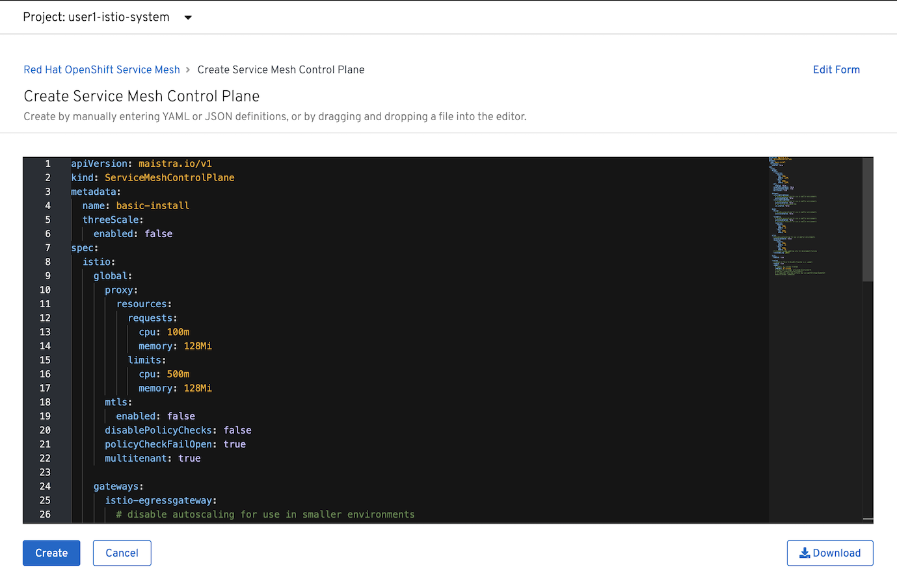


* Watch the progress of deployment
  ```bash
  watch oc get pods -n $USERID-istio-system
  #Sample output show deployment is on progress
  NAME                             READY   STATUS              RESTARTS   AGE
  istio-citadel-7dd77f956f-9rc9j   1/1     Running             0          42s
  istio-galley-7b644dc96c-w9p7h    0/1     ContainerCreating   0          1s
  jaeger-68dc8cdbb-9v4cp           0/2     ContainerCreating   0          2s
  prometheus-68b8b9b68f-9hbgm      2/2     Running             0          28s
  ```
  
  The entire installation process can take approximately 5-10 minutes. Confirm that following pods are up and running
  
  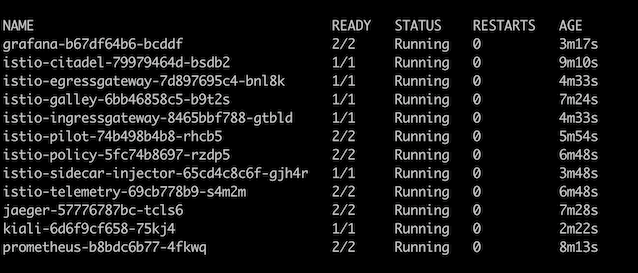

  Watch pods by Web Console, naviage to: Workloads -> Pods

  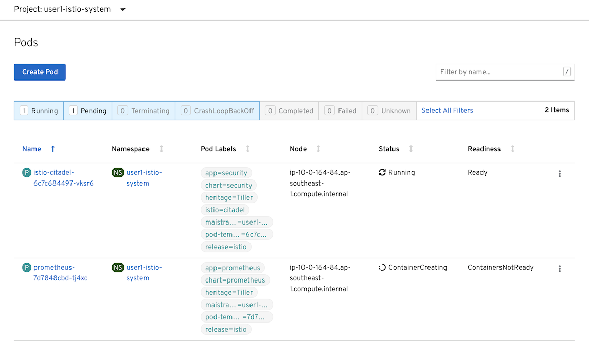

**Remark: Total number of pods is 12**

Verify control plane installation

```bash
oc get smcp -n ${USERID}-istio-system
```

Sample output

```bash
NAME            READY
basic-install   True
```

## Service Mesh Member Roll

The Service Mesh operator has installed a control plane configured for multitenancy. This installation reduces the scope of the control plane to only those projects/namespaces listed in a ServiceMeshMemberRoll.

In this section of the lab, you create a ServiceMeshMemberRoll resource with the project/namespaces you wish to be part of the mesh. This ServiceMeshMemberRoll is required to be named default and exist in the same namespace where the ServiceMeshControlPlane resource resides (ie: $USERID-istio-system).

Sample Service Mesh Member Roll [Member Roll](../install/memberroll.yml) for project name "userX"

**Remark: You need to change member to your User ID e.g. ${USERID}**

```yaml
apiVersion: maistra.io/v1
kind: ServiceMeshMemberRoll
metadata:
  name: default
spec:
  members:
  - userX
```

Use oc command to create member roll. Remark that you need to change member in [install/member.yml](../install/memberroll.yml) to your user ID before create member roll.

```bash
oc apply -f install/memberroll.yml -n $USERID-istio-system

```
Or use shell script to create Member Roll (This shell script required environment variable $USERID)

```bash
scripts/create-member-roll.sh
# Remark: this shell script use sed with OSX's style parameter
# Edit comment if you are on linux
```

Verify status of member roll

```bash
oc get smmr -n ${USERID}-istio-system
```

Sample output

```bash
NAME      MEMBERS
default   [user1]
```


<!-- By Web Console, navigate to: Operators -> Installed Operators then select Red Hat OpenShift Service Mesh and Select Create Instance under Istio Service Member Roll
Change member to your User ID (:ie user1) then select Create

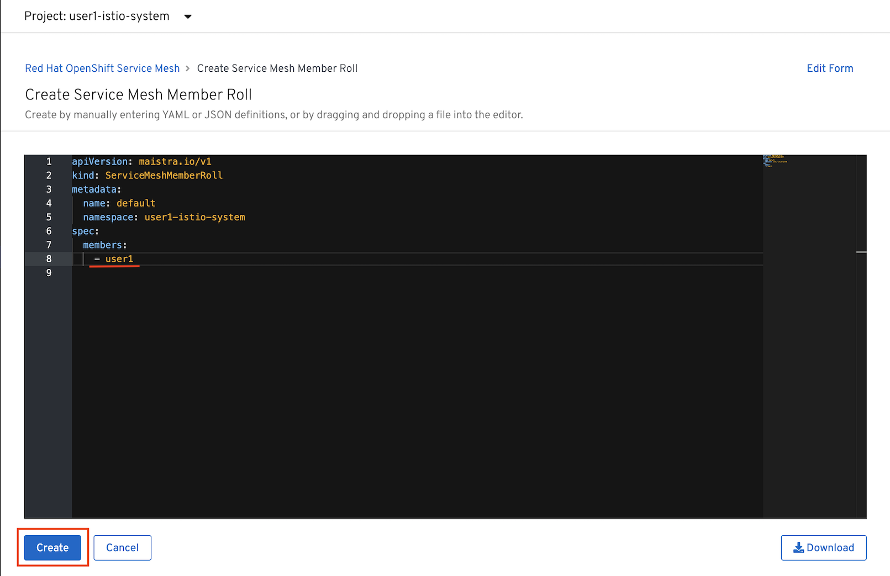

Verify that member roll is created

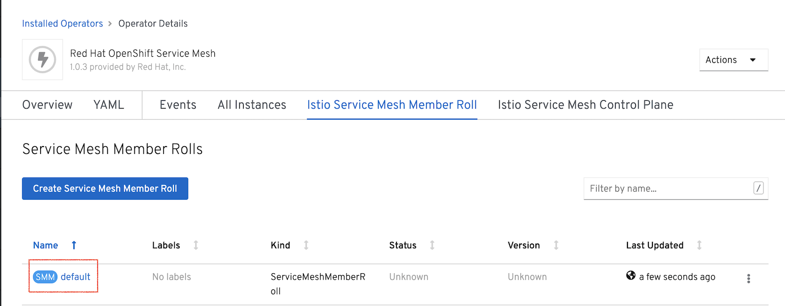 -->

## Next Topic

[MicroService Application Deployment](./02-microservice-deployment.md)