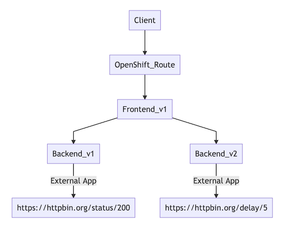
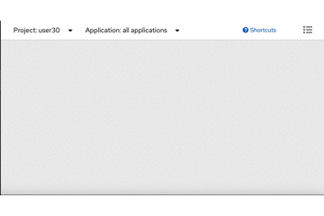
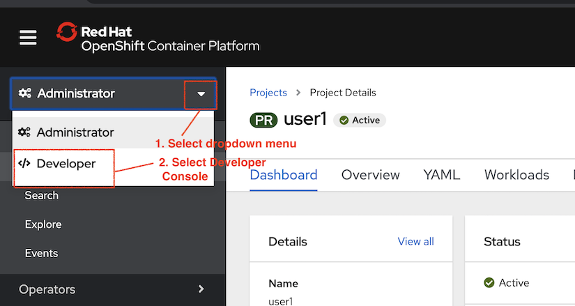
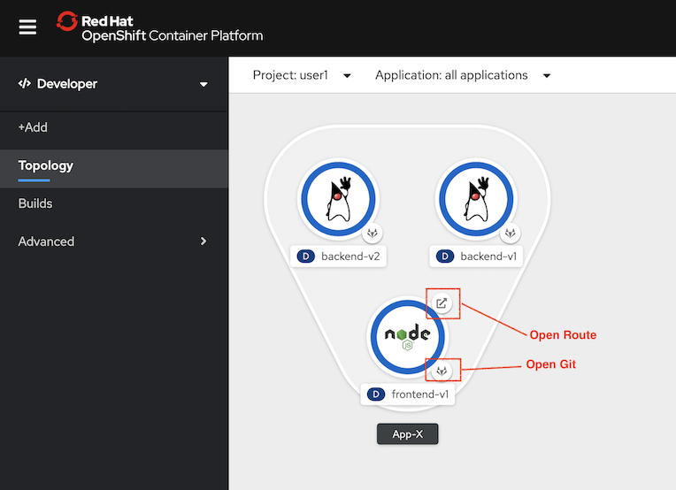
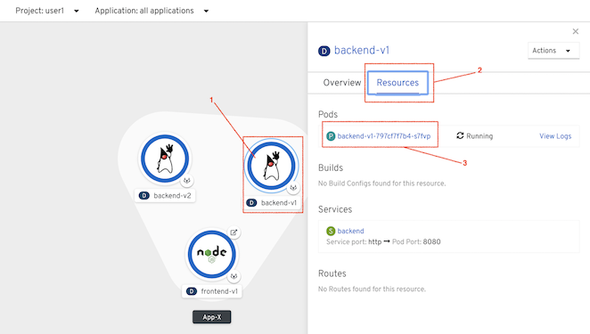
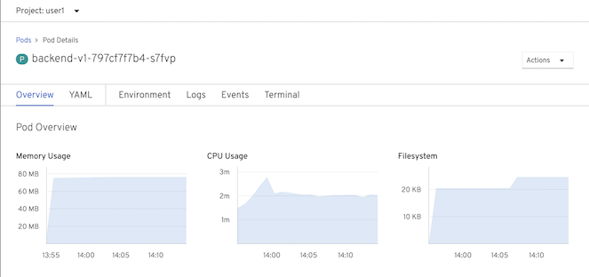
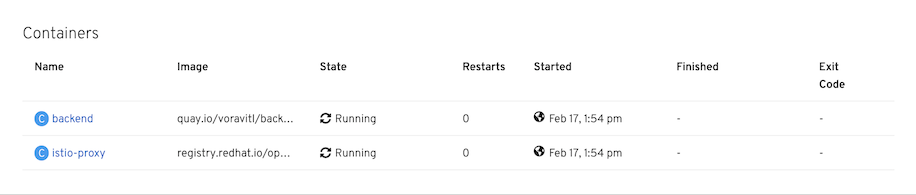
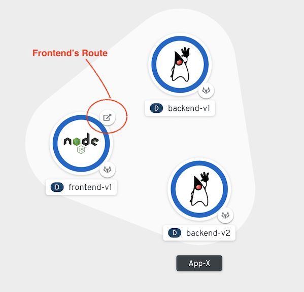

# Microservices Deployment Lab

<!-- TOC -->

- [Microservices Deployment Lab](#microservices-deployment-lab)
  - [Frontend and Backend app](#frontend-and-backend-app)
  - [Deploy Frontend and Backend app](#deploy-frontend-and-backend-app)
    - [Deploy Applications](#deploy-applications)
    - [OpenShift Developer Console](#openshift-developer-console)
    - [Test Appliation](#test-appliation)
  - [Next Topic](#next-topic)

<!-- /TOC -->

## Frontend and Backend app

Deploy microservices applications to OpenShift Container Platform 
Observe automatic injection of Service Mesh sidecar into each microservice

There are two microservices in this lab that you will deploy to OpenShift. In a later lab of this course, you will manage the interactions between these microservices using Red Hat OpenShift Service Mesh.




## Deploy Frontend and Backend app
You start by deploying the catalog service to OpenShift. The sidecar proxy is automatically injected by annotated deployment with 

```yaml
sidecar.istio.io/inject: "true"
```

Check for annotation section in [deployment of backend v1](../ocp/backend-v1-deployment.yml)

```yaml
spec:
  replicas: 1
  template:
    metadata:
      labels:
        app: backend
        version: v1
      annotations:
        sidecar.istio.io/inject: "true"
```

Review configuration of backend v1 and v2. 
* Backend v1 is configured to call https://httpbin.org/status/200 
  ```yaml
        env:
          - name: app.backend
            value: https://httpbin.org/status/200
  ```
* Backend v2 is configured to call https://httpbin.org/delay/5. This will caused Backend v2 delay 5 sec to respose back to Frontend
  ```yaml
        env:
          - name: app.backend
            value: https://httpbin.org/delay/5 
  ```

### Deploy Applications

```bash
oc apply -f ocp/frontend-v1-deployment.yml -n $USERID
oc apply -f ocp/frontend-service.yml -n $USERID
oc apply -f ocp/frontend-route.yml -n $USERID
oc apply -f ocp/backend-v1-deployment.yml -n $USERID
oc apply -f ocp/backend-v2-deployment.yml -n $USERID
oc apply -f ocp/backend-service.yml -n $USERID
```

or just run [deploy.sh](../scripts/deploy.sh) shell script

```bash
scripts/deploy.sh
```

Sample outout
```bash
deployment.extensions/frontend created
service/frontend created
route.route.openshift.io/frontend created
deployment.extensions/backend-v1 created
deployment.extensions/backend-v2 created
service/backend created
```

Monitor the deployment of the pods:
```bash
oc get pods -w -n $USERID
#Or use watch command 
watch oc get pods -n $USERID
```

Wait until the Ready column displays 2/2 pods and the Status column displays Running:
Press Control-C to exit.

You can also view pods status using OpenShift Developer Console Topology view



### OpenShift Developer Console

Login to OpenShift Web Console. Then select Developer Console and select menu Topology



Both Frontend and Backend app are shown as follow



Check for backend pod memory and cpu usage by click on donut, select tab resources and then select pod



CPU and memory usage of backend pod show as follow



Review container section that backend pod consists of 2 containers




### Test Appliation
Test frontend app by

```bash
export FRONTEND_URL=http://$(oc get route frontend -n $USERID -o jsonpath='{.status.ingress[0].host}')
curl $FRONTEND_URL
```
**Remark: You can use [get-urls.sh](../scripts/get-urls.sh) for display and set environment variables for all URLs used through out labs**

```bash
. ./scripts/get-urls.sh
##Remark that you need to use source (.) instead of run shell script
##for set environment variables
```

You can also get Frontend Route from Developer Console



Sample outout
```bash
Frontend version: v1 => [Backend: http://backend:8080, Response: 200, Body: Backend version:v2, Response:200, Host:backend-v2-7d69c678b4-7r4bb, Status:200, Message: Hello, World]
```
Explain result:

- Frontend version v1 call Backend service (with URL http://backend:8080)
- Response code is 200
- Response from Backend are
- version is v2
- pod backend-v2-7d69c678b4-7r4bb
- Response message from Backend is Hello World!!

Verify that [backend-service.yml](../ocp/backend-service.yml) is set to just app label. This will included both backend v1 in v2 into this backend service

```yaml
  selector:
    app: backend
```

Try to run cURL command again and check that response from backend will round-robin between v1 and v2 and v2 is elapsed time is slightly more than 5 sec.


You also can use following cURL for check response time
```bash
curl $FRONTEND_URL -s -w "\nElapsed Time:%{time_total}"
```

Sample output
```bash
Frontend version: v1 => [Backend: http://backend:8080, Response: 200, Body: Backend version:v1, Response:200, Host:backend-v1-797cf7f7b4-b9lnh, Status:200, Message: Hello, World]
Elapsed Time:1.034145
...

Frontend version: v1 => [Backend: http://backend:8080, Response: 200, Body: Backend version:v2, Response:200, Host:backend-v2-7d69c678b4-nrqmj, Status:200, Message: Hello, World]
Elapsed Time:6.095179
```

## Next Topic
[Observability with Kiali and Jaeger](./03-observability.md)