# Service Mesh Monitoring with Kiali Lab

Monitor your Istio service mesh with Kiali

<!-- TOC -->

- [Service Mesh Monitoring with Kiali Lab](#service-mesh-monitoring-with-kiali-lab)
  - [Review Service Mesh Monitoring](#review-service-mesh-monitoring)
  - [Explore Kiali](#explore-kiali)
  - [Using Kiali](#using-kiali)
    - [View Service Graph](#view-service-graph)
    - [Explore Service](#explore-service)
    - [Exploring Workload](#exploring-workload)
  - [Distributed Tracing](#distributed-tracing)
  - [Next Topic](#next-topic)

<!-- /TOC -->

## Review Service Mesh Monitoring

At some point when you are developing your microservices architecture, you may want to visualize what is happening in your service mesh. You may have questions like “Which service is connected to which other service?” and “How much traffic goes to each microservice?” But because of the loosely tied nature of microservices architectures, these questions can be difficult to answer.

Those are the kinds of question that Kiali has the ability to answer—by giving you a big picture of the mesh and showing the whole flow of your requests and data.

## Explore Kiali

Kiali taps into the data provided by Istio and OpenShift® Container Platform to generate its visualizations. It fetches ingress data (such as request tracing with Jaeger), the listing and data of the services, health indexes, and so on.

Kiali runs as a service together with Istio, and does not require any changes to Istio or OpenShift Container Platform configuration (besides the ones required to install Istio).

Get the URL of the Kiali web console and set as an environment variable:

```bash
export KIALI_URL=https://$(oc get route kiali -n $USERID-istio-system -o template --template='{{.spec.host}}')
# Display the KIALI_URL URL:
echo $KIALI_URL
```

You can also get URL to access Kiali from Developer Console.

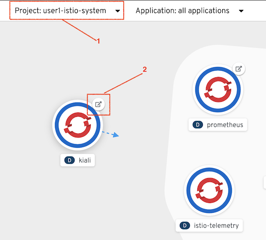


Kiali Login screen

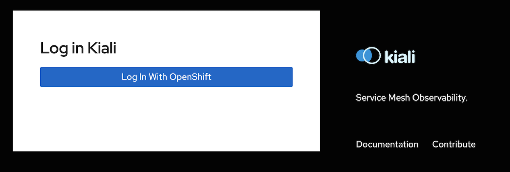

## Using Kiali


### View Service Graph

Move back to the Kiali web console. In the main console select your project. Then in the left-hand panel, Click Graph.

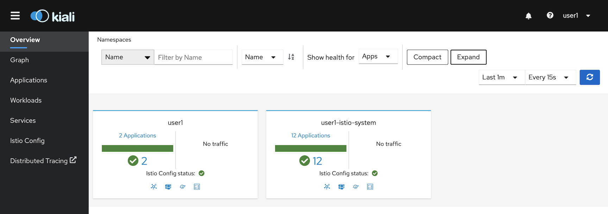

Select the Graph from left menu,  Select version graph and enable animation and set to display Requests Precentage

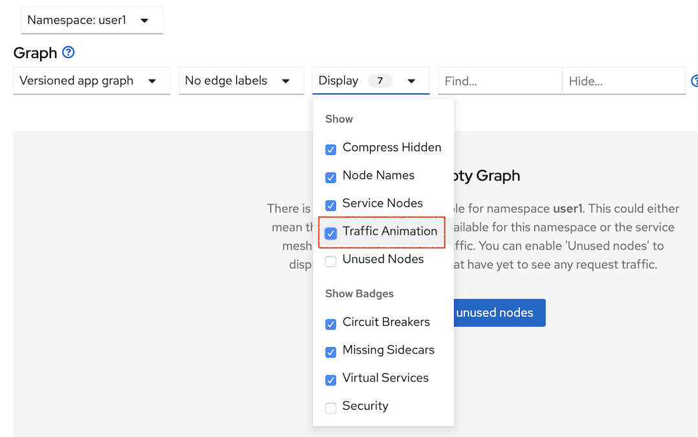

To show the capabilities of Kiali Graph, you need to generate some sample data. For this, you can use the microservices application that you deployed earlier.

Run following command on your terminal

```bash
#Set Environment Variables for Frontend's Route URL
source scripts/get-urls.sh

#Sample Output
FRONTEND_URL=frontend-user1.apps.cluster-a5d0.a5d0.example.opentlc.com
GATEWAY_URL=istio-ingressgateway-user1-istio-system.apps.cluster-a5d0.a5d0.example.opentlc.com
KIALI_URL=kiali-user1-istio-system.apps.cluster-a5d0.a5d0.example.opentlc.com
JAEGER_URL=jaeger-user1-istio-system.apps.cluster-a5d0.a5d0.example.opentlc.com

#Loop requests to Frontend App
scripts/run-50.sh
```

Sample output

```bash
...
Backend:v1, Response Code: 200, Host:backend-v1-797cf7f7b4-b9lnh, Elapsed Time:1.552174 sec
Backend:v2, Response Code: 200, Host:backend-v2-7d69c678b4-nrqmj, Elapsed Time:6.062042 sec
Backend:v1, Response Code: 200, Host:backend-v1-797cf7f7b4-b9lnh, Elapsed Time:0.804076 sec
Backend:v2, Response Code: 200, Host:backend-v2-7d69c678b4-nrqmj, Elapsed Time:5.845837 sec
...
```

Expect to see traffic animation on the graph based on traffic that is generated by the [scripts/run-50.sh](../scripts/run-50.sh) script you started earlier:

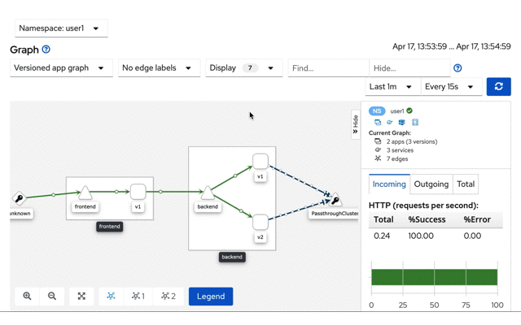

Remark that on the right of the screen show the result of requests (OK, 3xx, 4xx, 5xx)

Set Kiali Graph to show Response Time

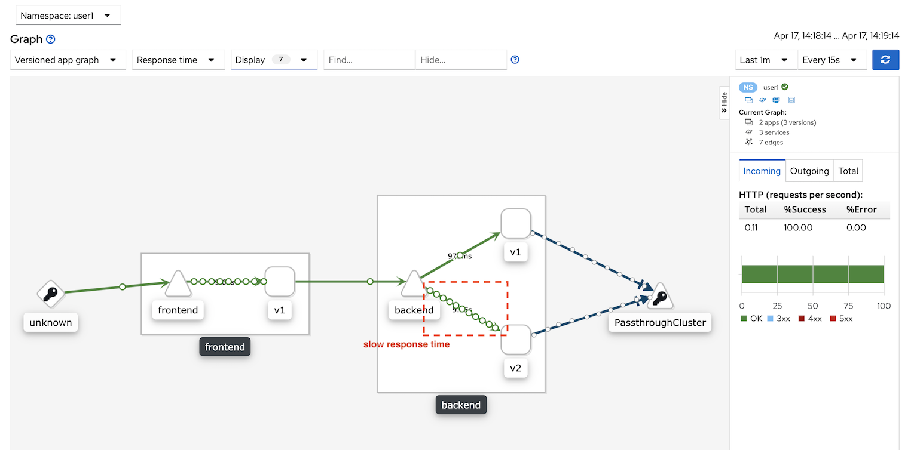


### Explore Service 

In the left-hand panel, click Services.

On the Services page you can view a listing of the services that are running in the cluster, and additional information about them such as health status.

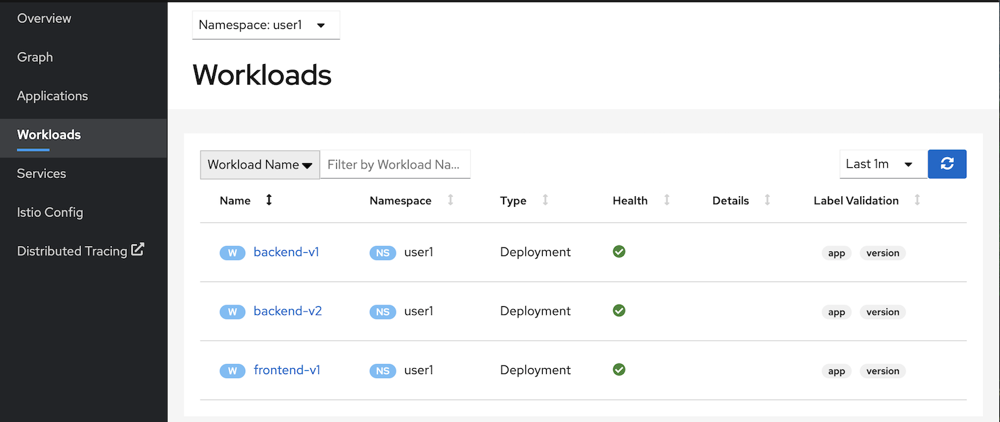

Remark: There is "Istio Config" in the left-hand panel. This can use for display and configure Istio policy. You can check this out in later labs

### Exploring Workload

In the left-hand panel, click Workloads. Then select workload you want to check for statistic. (eg: frontend)


Default page show overview information of selected workload.

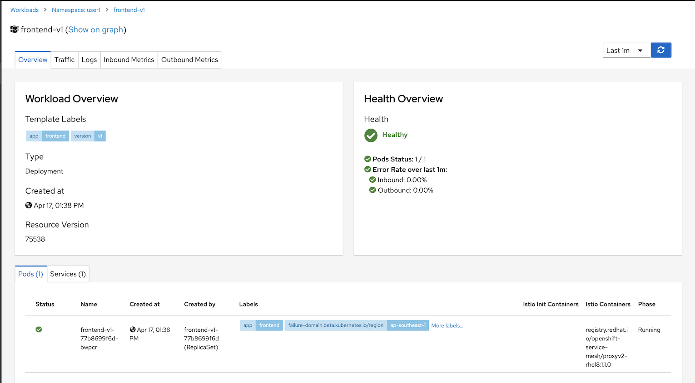

View log of each Pod by select tab Logs

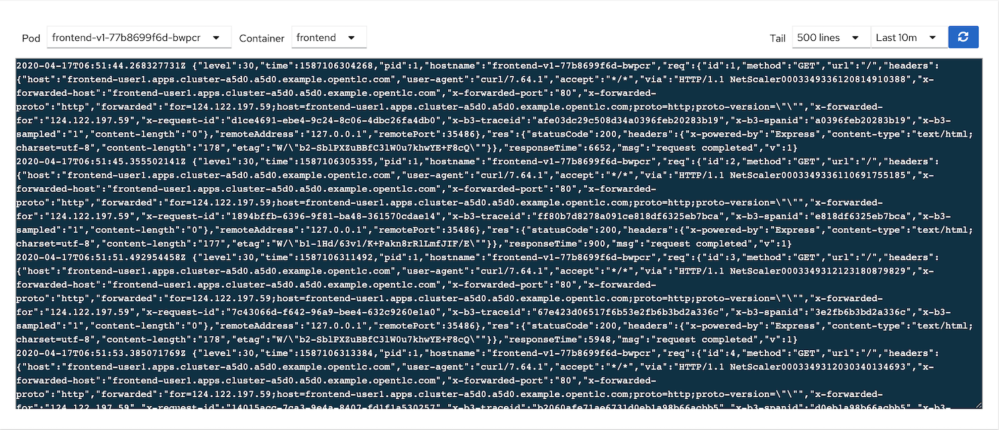

View Inbound/Outbound metrics by select Inbound and Outbound tab.

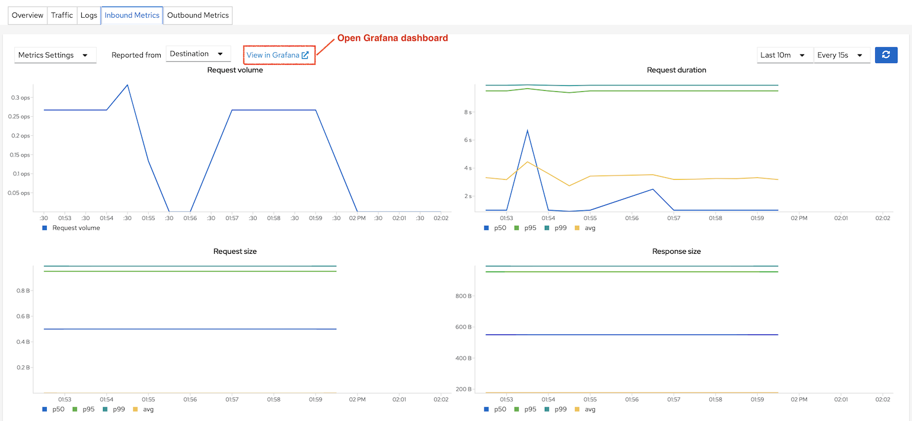

Open Grafana to view metrics data

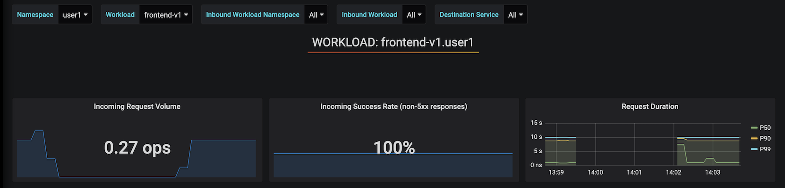

## Distributed Tracing

Jaeger implement OpenTracing for tracing microservices. Sampling rate and data store of Jaeger Get the URL of the Jaeger Web console and set as an environment variable or click Distributed Tracing on the left menu.

```bash
export JAEGER_URL=https://$(oc get route jaeger -n $USERID-istio-system -o template --template='{{.spec.host}}')
#Display the JAEGER_URL URL:
echo $JAEGER_URL
```


Test Jaeger by input search criteria with Service name "frontend.<project>" and set operation to backend service.

Notice that response time of Frontend app are separated into 2 groups one is around 6 sec and another one is around 1 sec. Because of our backend v2 configured with 6 sec delay.

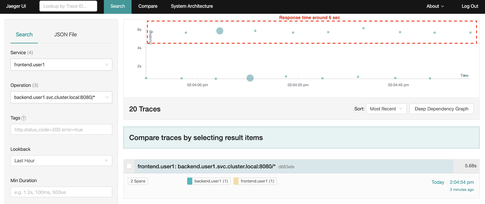

You can drill down to each transaction


Distributed tracing can be accessed via Kiali by menu Services => Select service => Traces

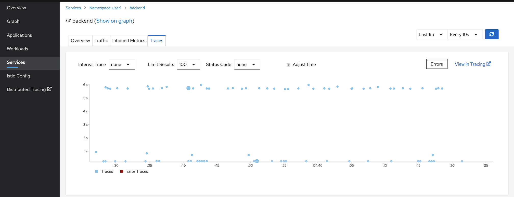
<!-- Jaeger can be accessed via Kiali by left-hand panel Distributed Tracing.
Remark: You need to login to Jaeger at least once to make this menu accessicble.

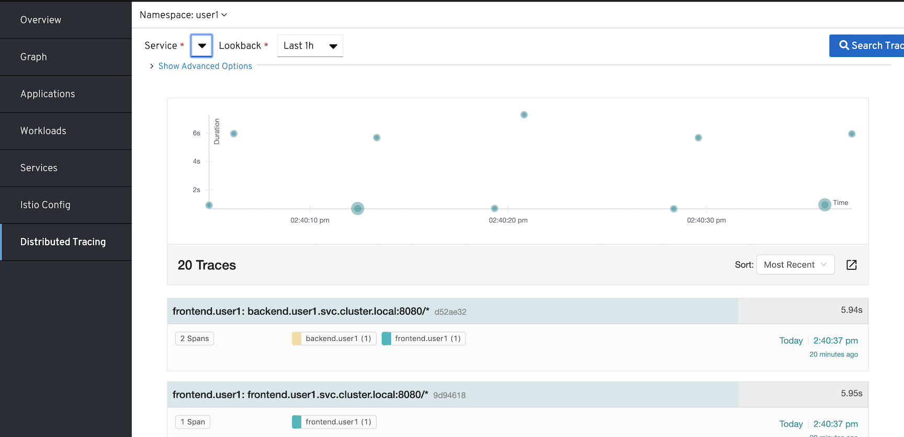 -->

## Next Topic
[Traffic Management](./04-traffic-management.md)