<!-- # Dynamic Routing Lab

Configure service mesh route rules to dynamically route and shape traffic between services -->

## Traffic Management
In this lab you dynamically alter routing between different versions of the backend service.
Routing within Service Mesh can be controlled by using Virtual Service and Routing Rules.

<!-- TOC -->

- [Traffic Management](#traffic-management)
- [Traffic splitting by Percentage](#traffic-splitting-by-percentage)
  - [Destination Rule](#destination-rule)
  - [Virtual Service](#virtual-service)
  - [Apply Istio Policy for A/B deployment](#apply-istio-policy-for-ab-deployment)
  - [Create Routing Policy by Kiali Console](#create-routing-policy-by-kiali-console)
  - [Verify Istio Configuration](#verify-istio-configuration)
  - [Test](#test)
  - [Bonus: Play with Weight](#bonus-play-with-weight)
- [Dark Launch by Mirroring Traffic](#dark-launch-by-mirroring-traffic)
- [Set Envoy Access Log](#set-envoy-access-log)
- [Cleanup](#cleanup)
- [Next Topic](#next-topic)

<!-- /TOC -->

<!-- Service Mesh Route rules control how requests are routed within service mesh.

Requests can be routed based on the source and destination, HTTP header fields, and weights associated with individual service versions. For example, a route rule could route requests to different versions of a service.

VirtualService defines a set of traffic routing rules to apply when a host is addressed. Each routing rule defines matching criteria for traffic of a specific protocol. If the traffic is matched, then it is sent to a named destination service (or subset/version of it) defined in the registry. The source of traffic can also be matched in a routing rule. This allows routing to be customized for specific client contexts.

DestinationRule defines policies that apply to traffic intended for a service after routing has occurred. These rules specify configuration for load balancing, connection pool size from the sidecar, and outlier detection settings to detect and evict unhealthy hosts from the load-balancing pool. -->

## Traffic splitting by Percentage

You do so via routing mechanisms available from OpenShift. You then make use of routing mechanisms available from Red Hat Service Mesh.

We can experiment with Istio routing rules by using our microservices application which contains 2 version of backend

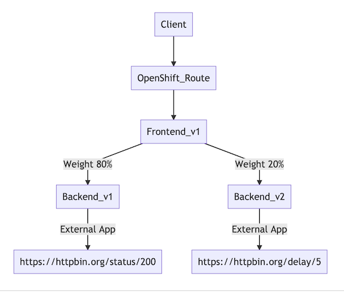

### Destination Rule

Review the following Istio's destination rule configuration file [destination-rule-backend-v1-v2.yml](../istio-files/destination-rule-backend-v1-v2.yml)  to define subset called v1 and v2 by matching label "app" and "version" and using Round Robin for load balancing policy.

**Remark: If you don't comfortable with YAML and CLI, You can try using [Kiali Console to create Istio policy](#routing-policy-with-kiali-console)**

```yaml
apiVersion: networking.istio.io/v1alpha3
kind: DestinationRule
metadata:
  name: backend
spec:
  host: backend
  subsets:
  - name: v1
    labels:
      app: backend
      version: v1
    trafficPolicy:
      loadBalancer:
        simple: ROUND_ROBIN
  - name: v2
    labels:
      app: backend
      version: v2
    trafficPolicy:
      loadBalancer:
        simple: ROUND_ROBIN
```

### Virtual Service

Review the following Istio's  virtual service configuration file [virtual-service-backend-v1-v2-80-20.yml](../istio-files/virtual-service-backend-v1-v2-80-20.yml) to route 80% of traffic to version v1 and 20% of traffic to version v2

```yaml
apiVersion: networking.istio.io/v1alpha3
kind: VirtualService
metadata:
  name: backend-virtual-service
spec:
  hosts:
  - backend
  http:
  - route:
    - destination:
        host: backend
        subset: v1
      weight: 80
    - destination:
        host: backend
        subset: v2
      weight: 20
```

### Apply Istio Policy for A/B deployment

Run oc apply command to apply Istio policy.

```bash
oc apply -f istio-files/destination-rule-backend-v1-v2.yml -n $USERID
oc apply -f istio-files/virtual-service-backend-v1-v2-80-20.yml -n $USERID
```

Sample outout

```bash
destinationrule.networking.istio.io/backend created
virtualservice.networking.istio.io/backend-virtual-service created
```

You can check status of Istio policies by

```bash
oc get istio-io -n $USERID
```

Sample output

```bash
NAME                                                           HOST      AGE
destinationrule.networking.istio.io/backend-destination-rule   backend   2m38s

NAME                                                         GATEWAYS   HOSTS       AGE
virtualservice.networking.istio.io/backend-virtual-service              [backend]   2m40s
```

### Create Routing Policy by Kiali Console 

**Remark: Menu for create Weight Routing will be grey out if there is any destination policy and/or virtual service already created for this service by CLI from yml file.**

Login to the Kiali web console. Select "Services" on the left menu. Then select backend service

On the main screen of backend service. Click Action menu on the top right and select "Create Weighted Routing"

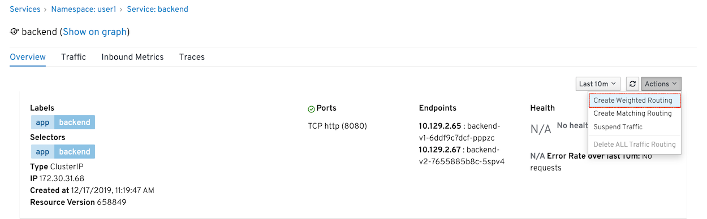

Use slider bar or input weight 

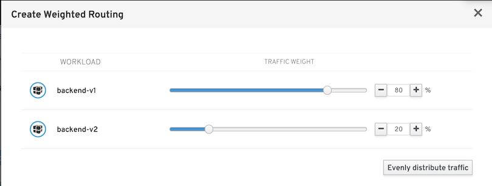

Click "Show Advanced Options" to explore more options

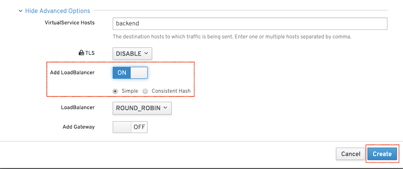

Click Create to create Destination Rule and Virtual Service. Then view result by select Virtual Service and Destination Rule on the bottom section of page.

Example of Virtual Service configuration

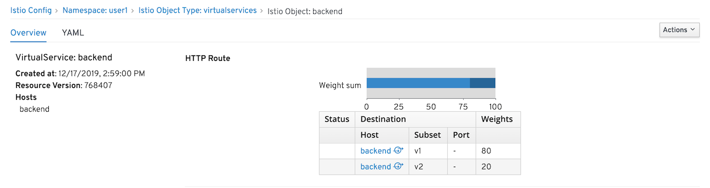

Example of Destination Rule configuration

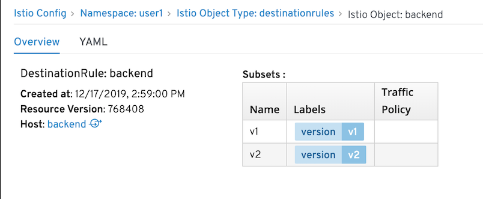

Remark: You can view YAML by click "YAML" tab

### Verify Istio Configuration

Login to the Kiali web console. Select "Istio Config" on the left menu. Verify that Destination Rule and Virtual Service are created and get green check mark. (If there is error in configuration. Check YAML tab, Kiali will highlight that which line(s) is caused error)

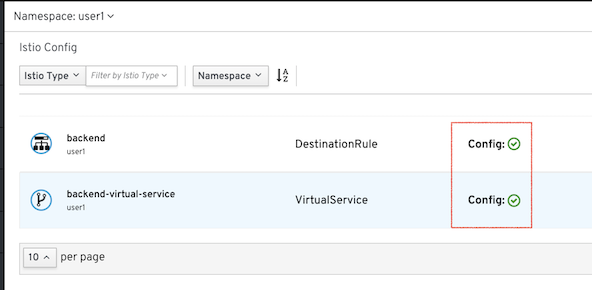

Check destination rule detail by select backend destination rule

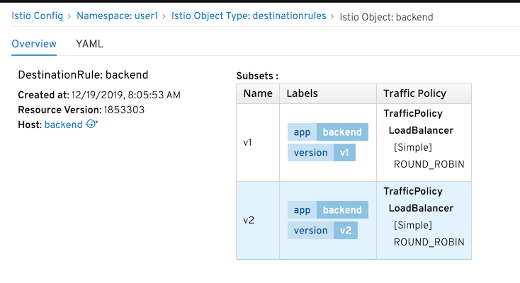

Click YAML to view YAML file. 
**Remark: You can also edit Istio configuration directly from YAML here**

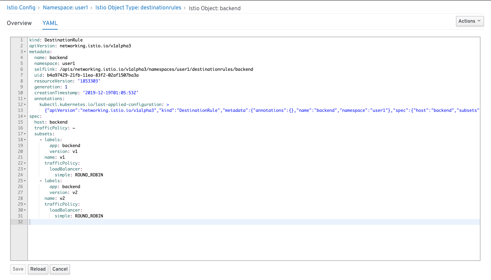


### Test

Test A/B deployment by run [run-50.sh](../scripts/run-50.sh)

```bash
scripts/run-50.sh
```

Sample output

```bash
...
Backend:v1, Response Code: 200, Host:backend-v1-6ddf9c7dcf-pppzc, Elapsed Time:0.890935 sec
Backend:v1, Response Code: 200, Host:backend-v1-6ddf9c7dcf-pppzc, Elapsed Time:1.084210 sec
Backend:v1, Response Code: 200, Host:backend-v1-6ddf9c7dcf-pppzc, Elapsed Time:0.952610 sec
Backend:v2, Response Code: 200, Host:backend-v2-7655885b8c-5spv4, Elapsed Time:5.823382 sec
Backend:v2, Response Code: 200, Host:backend-v2-7655885b8c-5spv4, Elapsed Time:5.805121 sec
Backend:v1, Response Code: 200, Host:backend-v1-6ddf9c7dcf-pppzc, Elapsed Time:0.778479 sec
Backend:v1, Response Code: 200, Host:backend-v1-6ddf9c7dcf-pppzc, Elapsed Time:0.856198 sec
Backend:v2, Response Code: 200, Host:backend-v2-7655885b8c-5spv4, Elapsed Time:5.993813 sec
Backend:v1, Response Code: 200, Host:backend-v1-6ddf9c7dcf-pppzc, Elapsed Time:0.787655 sec
========================================================
Total Request: 50
Version v1: 39
Version v2: 11
========================================================
```
You can check this splitting traffic with Kiali console by select Graph on left menu.

Select Versioned app graph, Request percentage and enable animation.

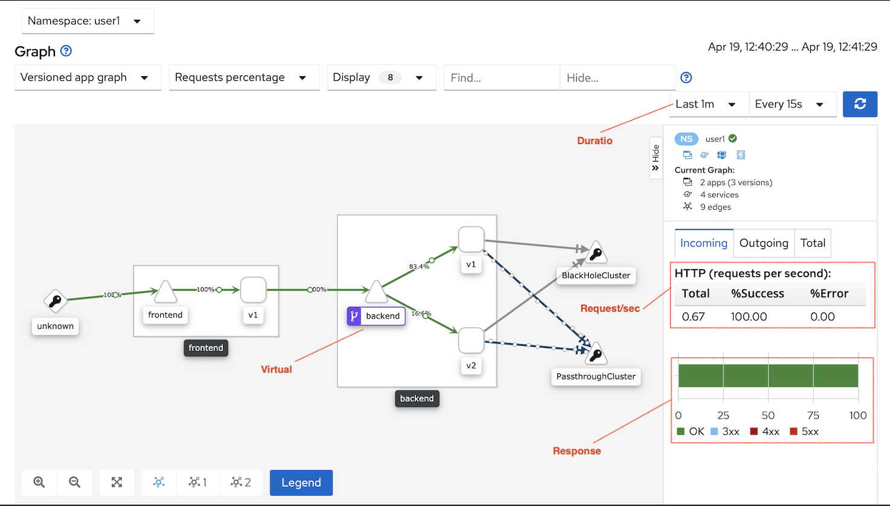

You can also check statistics of each service. From left menu Services, then select service e.g. backend-v1

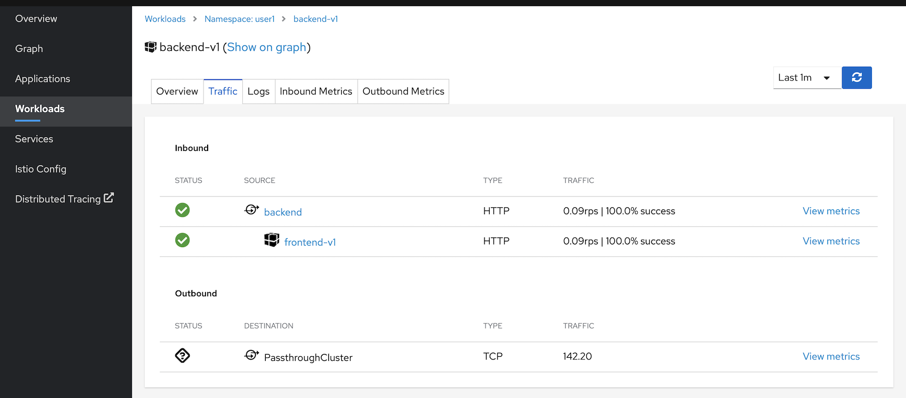

Select inbound metrics

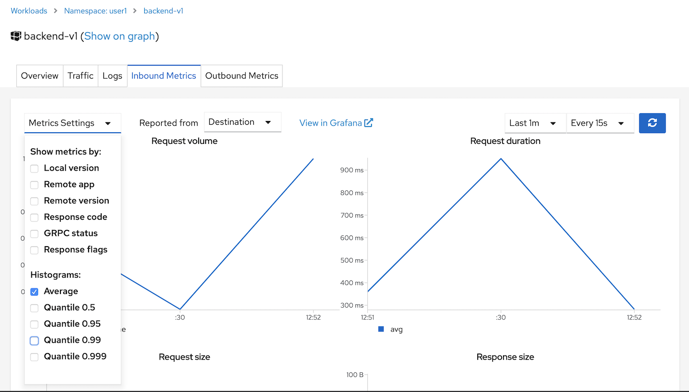


### Bonus: Play with Weight

Istio configuration is just normal Kubernetes Custom Resource Definition (CRD) then you can use oc command to play with it

Example

```bash
#Display list of destination rules
oc get DestinationRule -n $USERID

#Output
NAME       HOST       AGE
backend   backend   11h
```

Try to run "oc edit" to edit weight

```bash
oc edit DestinationRule backend
#Edit 80% and 20% and then save, run scripts/run-50.sh again then
#check Kiali Graph
```

Refer to [Verify Istio Config](#verify-istio-config) section. You can also edit config from Kiali.

## Dark Launch by Mirroring Traffic

Mirror all request to backend to backend-v3

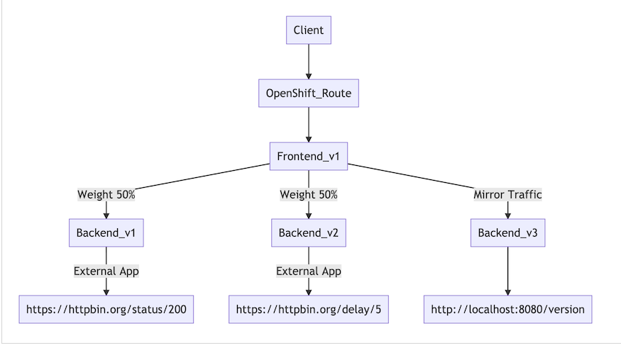

Run following command to create backend-v3

```

oc apply -f ocp/backend-v3-deployment.yml -n $USERID
oc apply -f ocp/backend-v3-service.yml -n $USERID

```

**Remark: backend v3 create with app label backend-v3 and servive name backend-v3 then backend v3 is not included in backend service. You verify [backend-service.yml](../ocp/backend-service.yml) for this configuration**

Review the following Istio's  virtual service configuration file [virtual-service-backend-v1-v2-mirror-to-v3.yml](../istio-files/virtual-service-backend-v1-v2-mirror-to-v3.yml) to mirror request to backend-v3

```yaml
  - route:
    - destination:
        host: backend
        subset: v1
      weight: 80
    - destination:
        host: backend
        subset: v2
      weight: 20
    mirror:
      host: backend-v3
```

Run oc apply command to apply Istio policy.

```bash
oc apply -f istio-files/virtual-service-backend-v1-v2-mirror-to-v3.yml -n $USERID
```

Sample outout

```bash
virtualservice.networking.istio.io/backend-virtual-service configured
```

Open anoter terminal to view backend-v3 log

```bash
#Use oc get pods to get pod name. Replace pod name in following commamnd
oc logs -f <backend-v3 pod> -c backend -n $USERID
```

Sample log output
```log
06:00:46 INFO  [co.ex.qu.BackendResource] (executor-thread-1) showResponse: false
06:00:46 INFO  [co.ex.qu.BackendResource] (executor-thread-2) Get Version
06:00:46 INFO  [co.ex.qu.BackendResource] (executor-thread-1) Return Code: 200
06:00:46 INFO  [co.ex.qu.BackendResource] (executor-thread-1) Request to: http://localhost:8080/version
06:00:46 INFO  [co.ex.qu.BackendResource] (executor-thread-1) showResponse: false
06:00:46 INFO  [co.ex.qu.BackendResource] (executor-thread-2) Get Version
06:00:46 INFO  [co.ex.qu.BackendResource] (executor-thread-1) Return Code: 200
06:00:46 INFO  [co.ex.qu.BackendResource] (executor-thread-1) Request to: http://localhost:8080/version
```

Using Kiali Web Console to view pod's log by select  on left menu then select log

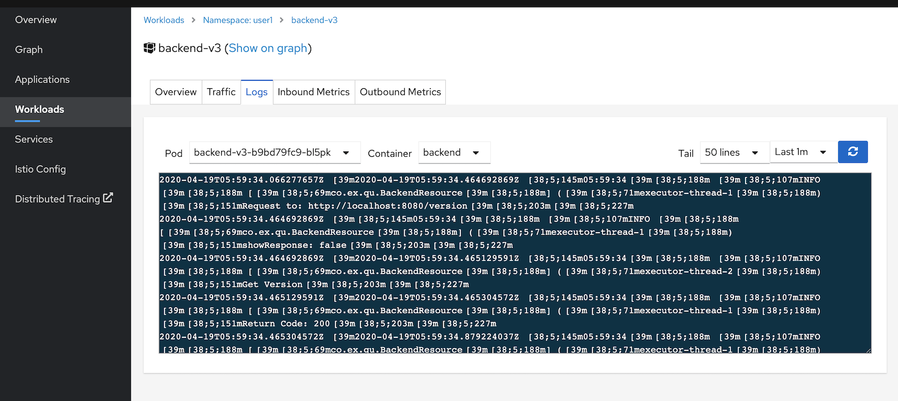

Run cURL to test that every request is sent to backend-v3 by checking log of backend-v3 again.

```bash
curl $FRONTEND_URL
```

Sample log output
```log
06:00:46 INFO  [co.ex.qu.BackendResource] (executor-thread-1) showResponse: false
06:00:46 INFO  [co.ex.qu.BackendResource] (executor-thread-2) Get Version
06:00:46 INFO  [co.ex.qu.BackendResource] (executor-thread-1) Return Code: 200
06:00:46 INFO  [co.ex.qu.BackendResource] (executor-thread-1) Request to: http://localhost:8080/version
06:00:46 INFO  [co.ex.qu.BackendResource] (executor-thread-1) showResponse: false
06:00:46 INFO  [co.ex.qu.BackendResource] (executor-thread-2) Get Version
06:00:46 INFO  [co.ex.qu.BackendResource] (executor-thread-1) Return Code: 200
06:00:46 INFO  [co.ex.qu.BackendResource] (executor-thread-1) Request to: http://localhost:8080/version
```

## Set Envoy Access Log
Envoy's access log can be printed to envoy (sidecar) standard output. This can be enabled by configure configmap **istio** in control plane project.

```bash
oc edit cm istio -n ${USERID}-istio-system
#or run shell script
scripts/envoy-log.sh
```
Set following attributes
- *accessLogFile* set to /dev/stdout
- *accessLogEncoding* set to TEXT or SJON
- Edit *accessLogFormat* if you want custom log format. Check [Envoy Document](https://www.envoyproxy.io/docs/envoy/latest/configuration/observability/access_log#format-rules) for more details.

Following show part of configmap

```json
# Set accessLogFile to empty string to disable access log.
    accesLogFile: "/dev/stdout"
# Set accessLogEncoding to JSON or TEXT to configure sidecar access log
    accessLogEncoding: 'TEXT'
```

Check backend's access log by using oc logs command
```bash
oc logs -f -c istio-proxy -n ${USERID} $(oc get pods -n ${USERID} | grep backend | head -n 1 | awk '{print $1}')
``` 
Access log show as follow:
```log
[2020-04-19T09:18:53.014Z] "GET / HTTP/1.1" 200 - "-" "-" 0 100 736 734 "-" "-" "ed6632af-a733-9136-a549-50ee76195a84" "backend:8080" "127.0.0.1:8080" inbound|8080|http|backend.user1.svc.cluster.local - 10.131.0.55:8080 10.128.2.54:41020 - default
[2020-04-19T09:18:53.024Z] "- - -" 0 - "-" "-" 697 402 5965 - "-" "-" "-" "-" "35.170.216.115:443" PassthroughCluster 10.131.0.55:32864 35.170.216.115:443 10.131.0.55:32862 - -
```
Each request contains 2 lines of log incoming request from application container (backend-v1) and outgoing request to httpbin.org
- backend.user1.svc.cluster.local - 10.131.0.55:8080 => 10.131.0.55 is IP address of this pod itself.
- 10.128.2.54:41020 => IP address of requester. That is frontend pod.
- 35.170.216.115:443 => IP address of httpbin.org

## Cleanup

Run oc delete command to remove Istio policy.

```bash
oc delete -f istio-files/virtual-service-backend-v1-v2-80-20.yml -n $USERID
oc delete -f istio-files/destination-rule-backend-v1-v2.yml -n $USERID
```

Delete all backend-v3 related

```bash
oc delete -f ocp/backend-v3-deployment.yml -n $USERID
oc delete -f ocp/backend-v3-service.yml -n $USERID
```

You can also remove Istio policy by using Kiali Console by select Istio Config menu on the left then select each configuration and select menu Action on the upper right of page. Then click Delete
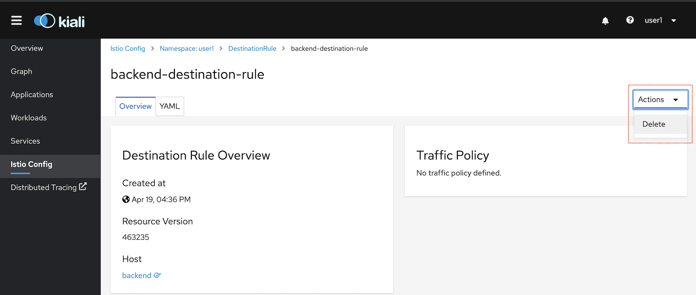

If you want to disable envoy's access log.
```bash
scripts/envoy-log-disable.sh
```

## Next Topic

[Ingress](./05-ingress.md)