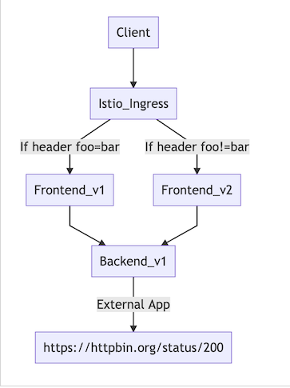
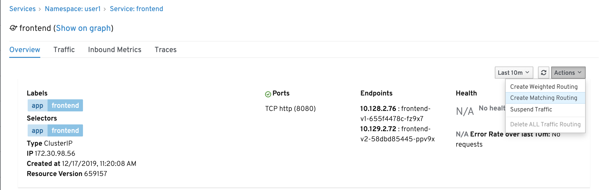
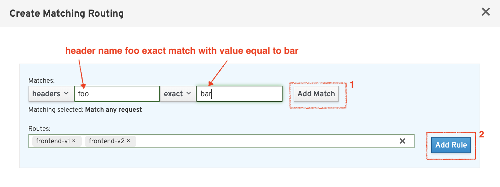
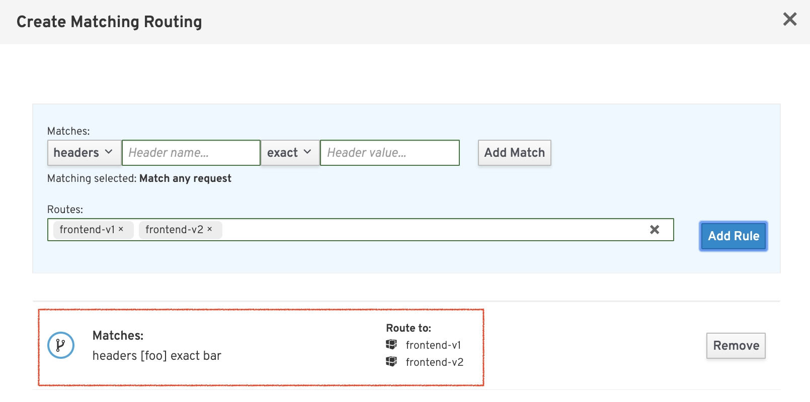
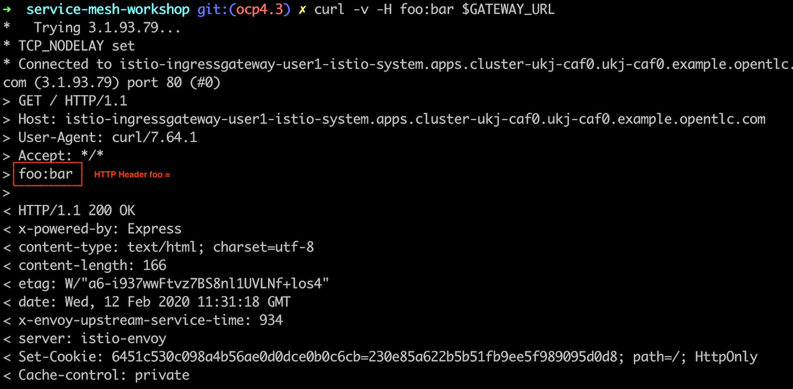
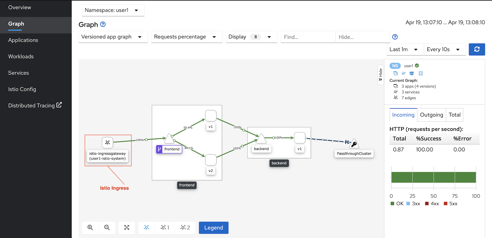
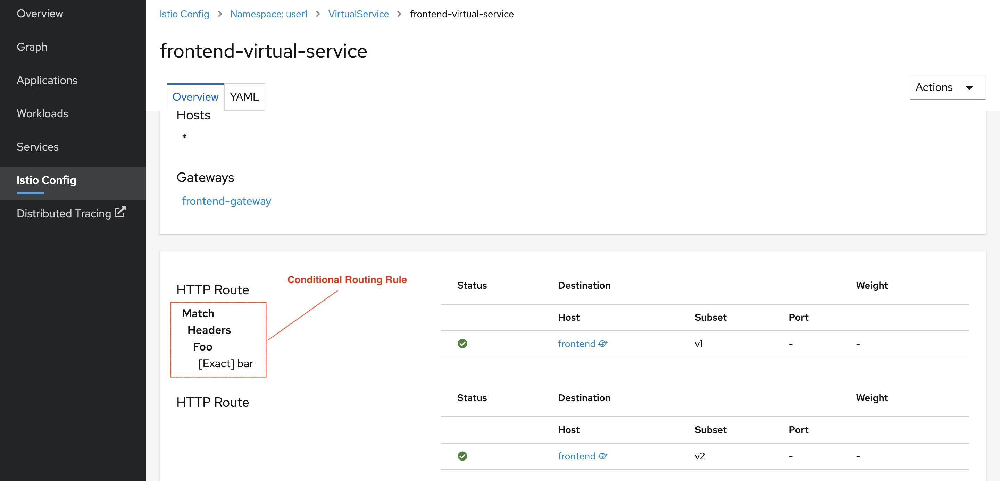
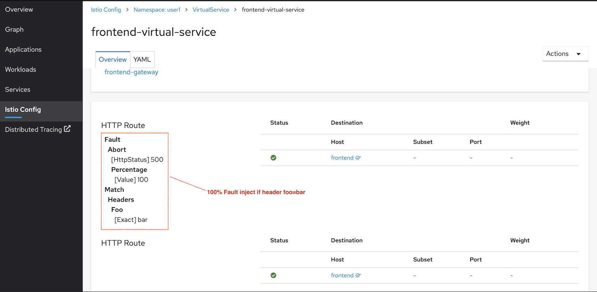

# Istio Gateway and Routing by HTTP header

<!-- TOC -->

- [Istio Gateway and Routing by HTTP header](#istio-gateway-and-routing-by-http-header)
  - [Setup](#setup)
  - [Istio Ingress Gateway](#istio-ingress-gateway)
  - [Routing by incoming HTTP header](#routing-by-incoming-http-header)
    - [Destination Rule](#destination-rule)
    - [Virtual Service](#virtual-service)
    - [Test](#test)
  - [Fault Injection](#fault-injection)
  - [Test](#test-1)
  - [Cleanup](#cleanup)
  - [Next Topic](#next-topic)

<!-- /TOC -->

Configure service mesh gateway to control traffic that entering mesh.



## Setup

Deploy frontend v2 and remove backend v2

```bash
oc apply -f ocp/frontend-v2-deployment.yml -n $USERID
oc delete -f ocp/backend-v2-deployment.yml -n $USERID
watch oc get pods -n $USERID 
#Or using oc get pods -w -n $USERID
#Sample Output
NAME                           READY   STATUS              RESTARTS   AGE
backend-v1-989c648f4-klsvl     2/2     Running             0          37m
backend-v2-549bbcbdd6-shw2j    0/2     Terminating         0          37m
frontend-v1-77b8699f6d-6vd56   2/2     Running             0          37m
frontend-v2-5c4bf794bd-vnjk6   0/2     ContainerCreating   0          13s
```

## Istio Ingress Gateway

Review the following Istio's Gateway rule configuration file [frontend-gateway.yml](../istio-files/frontend-gateway.yml)  to create Istio Gateway.

Run oc apply command to create Istio Gateway.

```bash
oc apply -f istio-files/frontend-gateway.yml -n $USERID
```

Sample outout

```bash
gateway.networking.istio.io/frontend-gateway created
```

<!-- **Remark: You can also using [Kiali Console to create Gateway](#create-gateway-using-kiali-console)** -->


## Routing by incoming HTTP header

### Destination Rule

Review the following Istio's destination rule configuration file [destination-rule-frontend-v1-v2.yml](../istio-files/destination-rule-frontend-v1-v2.yml)  to define subset called v1 and v2 by matching label "app" and "version"


Run oc apply command to create Istio Gateway.

```bash
oc apply -f istio-files/destination-rule-frontend-v1-v2.yml -n $USERID
```

Sample outout

```bash
destinationrule.networking.istio.io/frontend created
```

### Virtual Service
Review the following Istio's  virtual service configuration file [virtual-service-frontend-header-foo-bar-to-v1.yml](../istio-files/virtual-service-frontend-header-foo-bar-to-v1.yml) to routing request to v1 if request container header name foo with value bar

```yaml
- match:
    - headers:
        foo:
          exact: bar
    route:
    - destination:
        host: frontend
        subset: v1
```

Run oc apply command to apply Istio virtual service policy.

```bash
oc apply -f istio-files/virtual-service-frontend-header-foo-bar-to-v1.yml -n $USERID
```

Sample output

```bash
virtualservice.networking.istio.io/frontend created
```
<!-- ## Create Gateway using Kiali Console
Login to the Kiali web console. Select "Services" on the left menu. Then select frontend service

* On the main screen of backend service. Click Action menu on the top right and select "Create Matching Routing"


* Input Header name foo to exact match with value bar and then add rule


* Verify that header matching rule is added.


* Add Gateway by enable Advanced Option then select Add Gateway  -->

### Test

Get URL of Istio Gateway and set to environment variable by using following command

```bash
export GATEWAY_URL=$(oc -n $USERID-istio-system get route istio-ingressgateway -o jsonpath='{.spec.host}')
```

Verify that environment variable GATEWAY is set correctly.

```bash
echo $GATEWAY_URL

```

Sample output

```bash
istio-ingressgateway-user1-istio-system.apps.cluster-bkk77-eeb3.bkk77-eeb3.example.opentlc.com
```

Test with cURL by setting header name foo with value bar. Response will always from Frontend v1

```bash
curl -v -H foo:bar $GATEWAY_URL
```

Check for header foo in HTTP request



Sample outout

```bash
Frontend version: v1 => [Backend: http://backend:8080, Response: 200, Body: Backend version:v1, Response:200, Host:backend-v1-797cf7f7b4-b9lnh, Status:200, Message: Hello, World]
```

Test again witout specified parameter -H. Response will always from Frontend v2

Sample outout

```bash
Frontend version: v2 => [Backend: http://backend:8080, Response: 200, Body: Backend version:v1, Response:200, Host:backend-v1-797cf7f7b4-b9lnh, Status:200, Message: Hello, World]
```

You can also run script [run-50-foo-bar.sh](../scripts/run-50-foo-bar.sh) to generate round-robin request between frontend-v1 and frontend-v2

```bash
scripts/run-50-foo-bar.sh
```

Sample output

```bash
...
Frontend version: v2
Frontend version: v1
Frontend version: v2
Frontend version: v1
Frontend version: v2
...
```

Kiali Graph show that requests are from ingress gateway. (Comparing with "Unknown" from previous lab)



Check virtual service configuration 



## Fault Injection

Fault injection is strategy to test resiliency of your service.

We will remove frontend v2 and update destination rule to not included frontend v2 and apply virtual service with fault injection when header foo is equal to bar

```bash
oc apply -f istio-files/destination-rule-frontend.yml -n ${USERID}
oc apply -f istio-files/virtual-service-frontend-fault-inject.yml -n $USERID
oc delete -f ocp/frontend-v2-deployment.yml -n ${USERID}
watch oc get pods -n ${USERID}
```

Check virtual service with fault injection

```yaml
...
- fault:
      abort:
        #Return HTTP 500 for every request
        httpStatus: 500
        percentage:
          value: 100
    #When header foo = bar
    match:
    - headers:
        foo:
          exact: bar
...
```

Check virtual service configuration in Kiali console



## Test

You can use previous cURL command for test fault injection.

```bash
curl -v -H foo:bar  $GATEWAY_URL
```

Sample output

```bash
...
> User-Agent: curl/7.64.1
> Accept: */*
> foo:bar
>
< HTTP/1.1 500 Internal Server Error
< content-length: 18
< content-type: text/plain

...
```

Test again with header foo not equal to bar

```bash
curl -v -H foo:bar1  $GATEWAY_URL
```

Sample output

```bash
...
> User-Agent: curl/7.64.1
> Accept: */*
> foo:bar1
>
< HTTP/1.1 200 OK
...
```

## Cleanup
Run oc delete command to remove Istio policy.

```bash
oc delete -f istio-files/frontend-gateway.yml -n $USERID
oc delete -f istio-files/virtual-service-frontend-header-foo-bar-to-v1.yml -n $USERID
oc delete -f istio-files/destination-rule-frontend-v1-v2.yml -n $USERID
```

## Next Topic

[Egress](./06-gress.md)