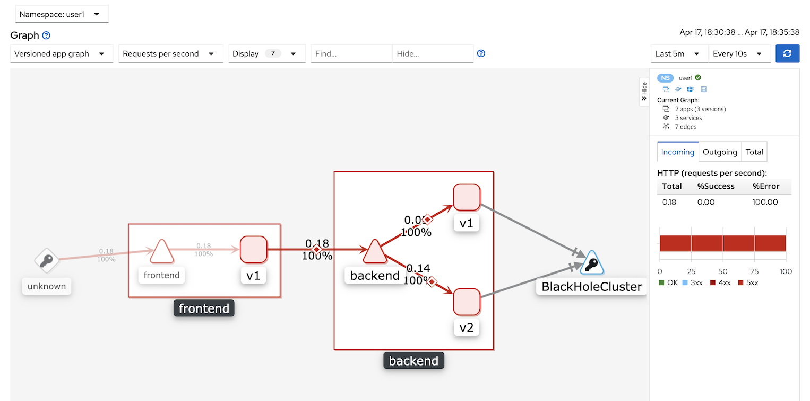
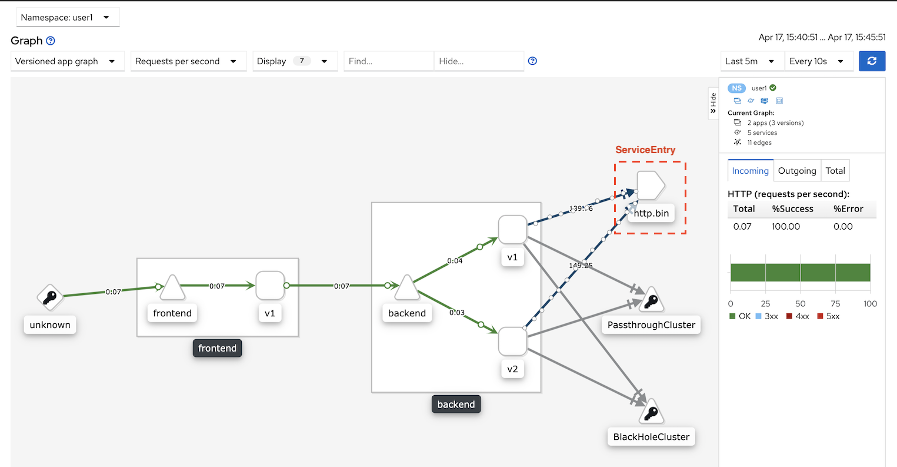

# Egress Gateway

<!-- TOC -->

- [Egress Gateway](#egress-gateway)
  - [Setup](#setup)
  - [Istio Egress Gateway](#istio-egress-gateway)
    - [ALLOW_ANY or REGISTRY_ONLY](#allowany-or-registryonly)
    - [Service Entry](#service-entry)
  - [Clean Up](#clean-up)
  - [Next Topic](#next-topic)

<!-- /TOC -->

## Setup

Deploy Frontend and Backend App 
```bash
oc apply -f ocp/frontend-v1-deployment.yml -n $USERID
oc apply -f ocp/frontend-service.yml -n $USERID
oc apply -f ocp/frontend-route.yml -n $USERID
oc apply -f ocp/backend-v1-deployment.yml -n $USERID
oc apply -f ocp/backend-v2-deployment.yml -n $USERID
oc apply -f ocp/backend-service.yml -n $USERID
```
or just run [deploy.sh](../scripts/deploy.sh) shell script
```bash
scripts/deploy.sh
```

## Istio Egress Gateway

### ALLOW_ANY or REGISTRY_ONLY

By default Istio allow request go outside Service Mesh. This configuration is in configmap **istio** within Istio Control Plane project.

Check configmap **istio**
```bash
oc get configmap istio -n ${USERID}-istio-system -o jsonpath='{.data.mesh}' | grep "mode: ALLOW_ANY"
```
You will get output similar to this
```yaml
mode: ALLOW_ANY
```
We can change this behavior of Istio to **locking-by-default** policy by change from *ALLOW_ANY* to *REGISTRY_ONLY* by run following command

```bash
 oc get configmap istio -n ${USERID}-istio-system -o yaml \
  | sed 's/mode: ALLOW_ANY/mode: REGISTRY_ONLY/g' \
  | oc replace -n ${USERID}-istio-system -f -
```
Test with cURL
```bash
curl -v ${FRONTEND_URL}

#Sample output - response with 503 error 
Frontend version: v1 => [Backend: http://backend:8080, Response: 503, Body: Backend version:v2, Response:503, Host:backend-v2-549bbcbdd6-q2wfs, Status:503, Message: Remote host terminated the handshake]* Closing connection 0
```
Run [run-50.sh](../scripts/run-50.sh) and Check Kiali Console Graph



### Service Entry
Create ServiceEntry to allow egress traffic to httpbin.org and allow only HTTPS and port 443. 

Check for [egress-serviceentry.yml](../istio-files/egress-serviceentry.yml)
```yaml
apiVersion: networking.istio.io/v1alpha3
kind: ServiceEntry
metadata:
  name: http.bin
spec:
  hosts:
  - httpbin.org
  ports:
  - number: 443
    name: https
    protocol: HTTPS
  resolution: DNS
  location: MESH_EXTERNAL
```

Apply [egress-serviceentry.yml](../istio-files/egress-serviceentry.yml) and test cURL
```bash
oc apply -f istio-files/egress-serviceentry.yml -n $USERID
curl ${FRONTEND_URL}
# Check that Response code is 200
```
Run [run-50.sh](../scripts/run-50.sh) and Check Kiali Console Graph



## Clean Up
Reconfigure istio configmap back to ALLOW_ANY
```bash
 oc get configmap istio -n ${USERID}-istio-system -o yaml \
  | sed 's/mode: REGISTRY_ONLY/mode: ALLOW_ANY/g' \
  | oc replace -n ${USERID}-istio-system -f -
```

Run oc delete command to remove Istio policy.
```bash
oc delete -f istio-files/egress-serviceentry -n $USERID

```

## Next Topic

[Timeout](./07-timeout.md)