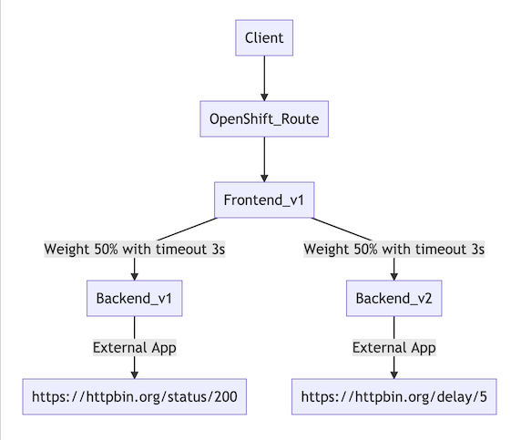
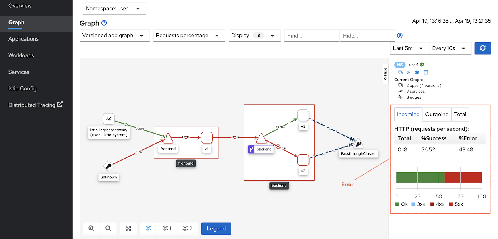

# Control Traffic with Timeout

<!-- TOC -->

- [Control Traffic with Timeout](#control-traffic-with-timeout)
  - [Setup](#setup)
- [Virtual Service](#virtual-service)
  - [Cleanup](#cleanup)
  - [Next Topic](#next-topic)

<!-- /TOC -->

## Setup

Currently backend v2 is set to delay response in 6 sec. We will set backend virtual service to wait for 3 sec (timeout 3 sec).  Frontend will received HTTP response with Gateway Timeout (504) if elapsed time is longer than timeout period.



Deploy frontend v1, backend v1 and backend v2.

```bash
oc apply -f ocp/frontend-v1-deployment.yml -n $USERID
oc apply -f ocp/frontend-service.yml -n $USERID
oc apply -f ocp/frontend-route.yml -n $USERID
oc apply -f ocp/backend-v1-deployment.yml -n $USERID
oc apply -f ocp/backend-v2-deployment.yml -n $USERID
oc apply -f ocp/backend-service.yml -n $USERID
watch oc get pods -n $USERID
#or 
#oc get pods -w -n $USERID
#Wait until all backend-v1 pods status are Runnings and all container in pods are ready (2/2)
```

# Virtual Service

Review the following Istio's  virtual service configuration file 
[virtual-service-backend-v1-v2-50-50-3s-timeout.yml](../istio-files/virtual-service-backend-v1-v2-50-50-3s-timeout.yml) to set timeout to 3 sec

```yaml
apiVersion: networking.istio.io/v1alpha3
kind: VirtualService
metadata:
  name: backend-virtual-service
spec:
  hosts:
  - backend
  http:
  - timeout: 3s
    route:
    - destination:
        host: backend
        subset: v1
      weight: 50
    - destination:
        host: backend
        subset: v2
      weight: 50
```

Run oc apply command to apply Istio policy.

```bash
oc apply -f istio-files/destination-rule-backend-v1-v2.yml -n $USERID
oc apply -f istio-files/virtual-service-backend-v1-v2-50-50-3s-timeout.yml -n $USERID
```

Sample outout

```bash
destinationrule.networking.istio.io/backend created
virtualservice.networking.istio.io/backend-virtual-service created
```

Test again with cURL and check for 504 response code from backend version v2

```bash
curl $FRONTEND_URL
```

Result

```bash
Frontend version: v1 => [Backend: http://backend:8080, Response: 504, Body: upstream request timeout]
```

Run [run-50.sh](../scripts/run-50.sh)

```bash
scripts/run-50.sh
```

Sample output
```log
...
Backend:v1, Response Code: 200, Host:backend-v1-6ddf9c7dcf-pppzc, Elapsed Time:0.774024 sec
Backend:, Response Code: 504, Host:, Elapsed Time:3.193873 sec
Backend:v1, Response Code: 200, Host:backend-v1-6ddf9c7dcf-pppzc, Elapsed Time:0.787584 sec
Backend:, Response Code: 504, Host:, Elapsed Time:3.724406 sec
Backend:, Response Code: 504, Host:, Elapsed Time:3.147017 sec
Backend:, Response Code: 504, Host:, Elapsed Time:3.207459 sec
========================================================
Total Request: 50
Version v1: 25
Version v2: 0
========================================================
...
```

Check Graph in Kiali Console with Response time.



## Cleanup
Run oc delete command to remove Istio policy.

```bash
oc delete -f istio-files/virtual-service-backend-v1-v2-80-20.yml -n $USERID
oc delete -f istio-files/destination-rule-backend-v1-v2.yml -n $USERID
```

## Next Topic

[Circuit Breaker](./08-circuit-breaker.md)