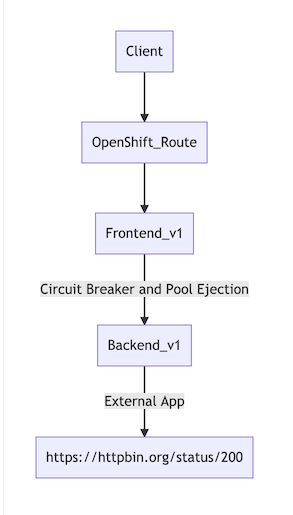
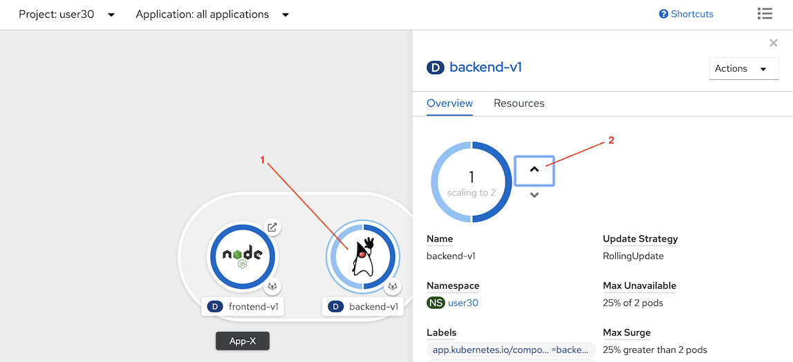
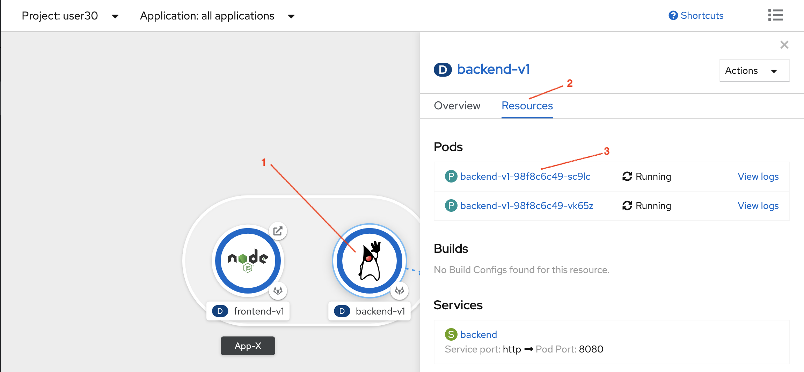
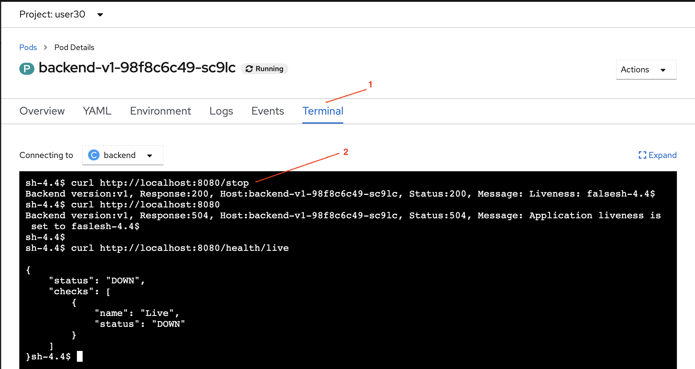
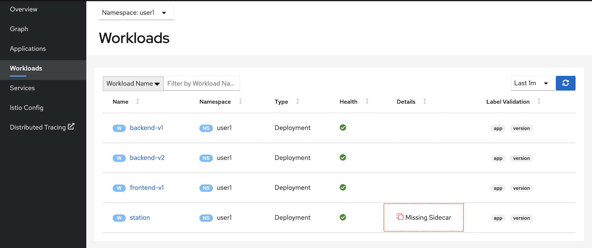

# Service Resilience by Circuit Breaker Lab

Circuit breaking is one of pattern to build reslilient microservices. The idea is limit the impact of failures.

In our lab, we will simulate that one pod of backend service has some error. We will use circuit breaker with pool ejection concept that if error happen then that particular pod will be ejected from pool in a period of time. This will result that frontend will not call that pod. So, failure will be minimized.

<!-- TOC -->

- [Service Resilience by Circuit Breaker Lab](#service-resilience-by-circuit-breaker-lab)
  - [Setup](#setup)
  - [Circuit Breaker and Pool Ejection](#circuit-breaker-and-pool-ejection)
  - [Test](#test)
  - [Clean Up](#clean-up)
  - [Next Topic](#next-topic)

<!-- /TOC -->


## Setup

Setup microservices apps by remove backend-v2 and scale backend-v1 to 3 pods. 



```bash
oc delete -f ocp/backend-v2-deployment.yml -n $USERID
oc scale deployment backend-v1 --replicas=2 -n $USERID
watch oc get pods -n $USERID

#or 
#oc get pods -w -n $USERID
#Wait until all backend-v1 pods status are Runnings and all container in pods are ready (2/2)
```

Sample output

```bash
NAME                          READY   STATUS    RESTARTS   AGE
backend-v1-6ddf9c7dcf-sqxqz   2/2     Running   0          8h
backend-v1-6ddf9c7dcf-vm6kb   2/2     Running   0          8h
frontend-v1-655f4478c-wn7wr   2/2     Running   0          9h
```

You can also scaleup pod by using OpenShift Developer Console. From Topology view, click on Backend v1 donut, Overview tab.

Scale pod to 2 by click upper arrow icon.



We will force one backend-v1 pod to return 504. This can be done by rsh into pod the curl to /stop (backend-v1 will always return 504 after receiving /stop. This is for demo)

Select one pod and connect to pod's terminal by using following oc command or OpenShift Web Console.

```bash
oc exec -n $USERID -c backend $(oc get pod -n $USERID | grep -m1 backend | cut -d " " -f1) -- curl -s http://localhost:8080/stop
#or
oc exec -n $USERID  -c backend <pod name>  -- curl -s  http://localhost:8080/stop
```

Sample output
```bash
Backend version:v1, Response:200, Host:backend-v1-6ddf9c7dcf-sqxqz , Status:200, Message: Liveness: false

```

Then verify that pod will in previous step will return 504 when recieving request.

```bash
oc exec -n $USERID -c backend $(oc get pod -n $USERID | grep -m1 backend | cut -d " " -f1) -- curl -s  -w "\nResponse Code:%{response_code}" http://localhost:8080

#or

oc exec -n $USERID  -c backend <pod name>  -- curl -s  -w "\nResponse Code:%{response_code}" http://localhost:8080
```

Sample output

```bash
Backend version:v1, Response:504, Host:backend-v1-6ddf9c7dcf-sqxqz , Status:504, Message: Application liveness is set to false
Response Code:504
```


You can also use OpenShift Developer Console. From Topology view, click on Backend v1 donut, Resources tab, click on one pod.



select Terminal tab then run cURL command



Test with [run50.sh](../scripts/run-50.sh) and check that response is round robin between 504 and 200 

```bash
scripts/run-50.sh
```

Sample output

```bash
...
Backend:v1, Response Code: 200, Host:backend-v1-98f8c6c49-cdvbh, Elapsed Time:1.508606 sec
Backend:v1, Response Code: 504, Host:backend-v1-98f8c6c49-vk65z, Elapsed Time:0.161270 sec
Backend:v1, Response Code: 200, Host:backend-v1-98f8c6c49-cdvbh, Elapsed Time:0.367105 sec
Backend:v1, Response Code: 504, Host:backend-v1-98f8c6c49-vk65z, Elapsed Time:0.139964 sec
Backend:v1, Response Code: 200, Host:backend-v1-98f8c6c49-cdvbh, Elapsed Time:0.358144 sec
Backend:v1, Response Code: 504, Host:backend-v1-98f8c6c49-vk65z, Elapsed Time:0.148808 sec
...
```

## Circuit Breaker and Pool Ejection

Review the following Istio's destination rule configuration file [destination-rule-backend-circuit-breaker-with-pool-ejection.yml](../istio-files/destination-rule-backend-circuit-breaker-with-pool-ejection.yml)  to define circuit breaker and pool ejection with following configuration.

```yaml
trafficPolicy:
      connectionPool:
        http: {}
        tcp: {}
      loadBalancer:
        simple: ROUND_ROBIN
      outlierDetection:
        baseEjectionTime: 15m
        consecutiveErrors: 1
        interval: 15m
        maxEjectionPercent: 100
```

Explain traffice policy configuration:

- Detect error with condition:
- If found 1 consecutive error (consecutiveErrors)
- then eject that pod from pool for 15 minutes (baseEjectionTime)
- All of pods can be ejected (maxEjectionPercent)
- check again within 15 minutes (interval)

Apply destination rule to enable circuit breaker with pool ejection for backend service

```bash
oc apply -f istio-files/virtual-service-backend.yml -n $USERID
oc apply -f istio-files/destination-rule-backend-circuit-breaker-with-pool-ejection.yml -n $USERID
```

Sample output

```bash
virtualservice.networking.istio.io/backend-virtual-service created
destinationrule.networking.istio.io/backend-destination-rule created
```

## Test

Test with [run50.sh](../scripts/run-50.sh) again and check that you will get 504 only one time. Because that particular pod is ejected from pool and only pods those return 200 OK still stayed in pool.

Sample output

```bash
Backend:v1, Response Code: 200, Host:backend-v1-98f8c6c49-cdvbh, Elapsed Time:1.508682 sec
Backend:v1, Response Code: 504, Host:backend-v1-98f8c6c49-vk65z, Elapsed Time:0.174340 sec
Backend:v1, Response Code: 200, Host:backend-v1-98f8c6c49-cdvbh, Elapsed Time:0.371816 sec
Backend:v1, Response Code: 200, Host:backend-v1-98f8c6c49-cdvbh, Elapsed Time:0.366507 sec
...
...
...
Backend:v1, Response Code: 200, Host:backend-v1-98f8c6c49-cdvbh, Elapsed Time:0.362117 sec
Backend:v1, Response Code: 200, Host:backend-v1-98f8c6c49-cdvbh, Elapsed Time:0.470078 sec
Backend:v1, Response Code: 200, Host:backend-v1-98f8c6c49-cdvbh, Elapsed Time:0.363250 sec
Backend:v1, Response Code: 200, Host:backend-v1-98f8c6c49-cdvbh, Elapsed Time:0.485674 sec
========================================================
Total Request: 50
Version v1: 49
Version v2: 0
========================================================
```

Check Kiali Graph



## Clean Up

Run oc delete command to remove Istio policy.

```bash
oc delete -f istio-files/destination-rule-backend-circuit-breaker-with-pool-ejection.yml -n $USERID
oc delete -f istio-files/virtual-service-backend.yml -n $USERID
oc delete -f ocp/backend-v1-deployment.yml -n $USERID
oc delete -f ocp/backend-service.yml -n $USERID
oc delete -f ocp/frontend-v1-deployment.yml -n $USERID
oc delete -f ocp/frontend-service.yml -n $USERID
oc delete -f ocp/frontend-route.yml -n $USERID
```

## Next Topic

[Secure with mTLS](./09-securing-with-mTLS.md)
