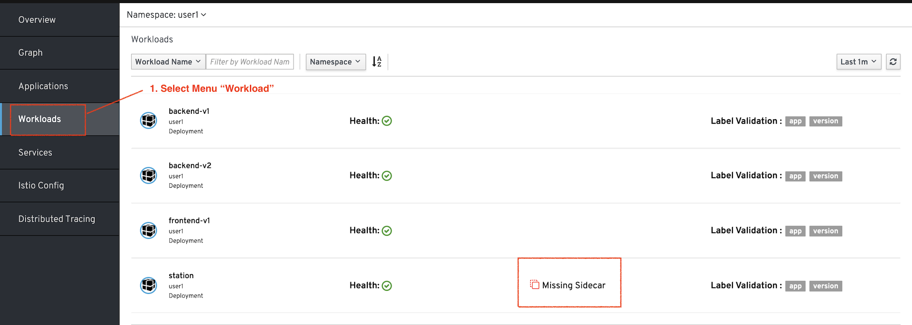
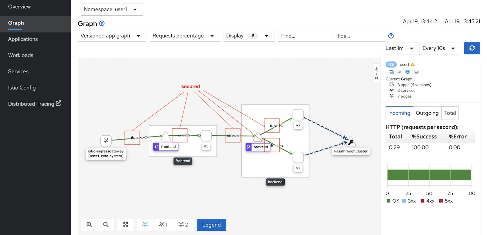

# Secure Service with Mutual TLS

Mutual TLS is quite cubersome for develop to authenticate with client side certificate. Istio sidecar can automatically validate mutual TLS for communication within Mesh.

<!-- TOC -->

- [Secure Service with Mutual TLS](#secure-service-with-mutual-tls)
  - [Setup](#setup)
  - [Enable Mutual TLS for Backend Service](#enable-mutual-tls-for-backend-service)
    - [Test](#test)
  - [Enable Mutual TLS for Frontend Service](#enable-mutual-tls-for-frontend-service)
    - [Test](#test-1)
  - [Clean Up](#clean-up)
  - [Next Topic](#next-topic)

<!-- /TOC -->

## Setup

```bash
oc apply -f ocp/frontend-v1-deployment.yml -n $USERID
oc apply -f ocp/frontend-service.yml -n $USERID
oc apply -f ocp/frontend-route.yml -n $USERID
oc apply -f ocp/backend-v1-deployment.yml -n $USERID
oc apply -f ocp/backend-v2-deployment.yml -n $USERID
oc apply -f ocp/backend-service.yml -n $USERID
watch oc get pods -n $USERID
```

Create another pod without sidecar for testing


```bash
oc apply -f ocp/station-deployment.yml -n $USERID
```

Verify that deployment of station

```yaml
annotations:
        sidecar.istio.io/inject: "false"
```

Check that station pod has no sidecar

```bash
oc get pod -n $USERID
```

Sample output. station pod is 1/1

```bash
NAME                          READY   STATUS    RESTARTS   AGE
backend-v1-98f8c6c49-mpcxv     2/2     Running   0          13m
backend-v2-7699759f8f-hhww5    2/2     Running   0          70s
frontend-v1-77b8699f6d-kjz5c   2/2     Running   0          4h56m
station-7b8b6645b-sjtqp        1/1     Running   0          20s
```

You can also check Kiali console that station does not have sidecar


Test by using station pod to connect to backend pod

```bash
oc exec -n $USERID $(oc get pod -n $USERID | grep station | cut -d " " -f1) \
curl http://backend:8080 -n $USERID

#or

oc exec -n $USERID <station pod> curl http://backend:8080 -n $USERID
```

Sample Outout

```bash
Backend version:v1,Response:200,Host:backend-v1-6ddf9c7dcf-vlcr9, Message: Hello World!!
```

## Enable Mutual TLS for Backend Service

Review the following Istio's authenticaiton rule configuration file [authentication-backend-enable-mtls.yml](../istio-files/authentication-backend-enable-mtls.yml)  to enable authenticaion with following configuration.

```yaml
spec:
  targets:
  - name: backend
    ports:
    - number: 8080
  peers:
  - mtls: {}
```

Review the following Istio's destination rule configuration file [destination-rule-backend-v1-v2-mtls.yml](../istio-files/destination-rule-backend-v1-v2-mtls.yml)  to enable client side certification (Mutual TLS) with following configuration.

```yaml
  trafficPolicy:
      loadBalancer:
        simple: ROUND_ROBIN
      tls:
        mode: ISTIO_MUTUAL
```

Apply authentication, destination rule and virtual service to backend service

```bash
oc apply -f istio-files/destination-rule-backend-v1-v2-mtls.yml -n $USERID
oc apply -f istio-files/virtual-service-backend-v1-v2-50-50.yml -n $USERID
oc apply -f istio-files/authentication-backend-enable-mtls.yml -n $USERID
```

Sample output

```bash
destinationrule.networking.istio.io/backend created
virtualservice.networking.istio.io/backend-virtual-service created
policy.authentication.istio.io/authentication-backend-mtls created
```

### Test

Test with oc exec again from station pod

```bash
oc exec -n $USERID $(oc get pod -n $USERID | grep station | cut -d " " -f1) -- curl -s http://backend:8080

#or

oc exec -n $USERID <station pod> curl http://backend:8080
```

Sample output

```bash
curl: (56) Recv failure: Connection reset by peer
command terminated with exit code 56
```

Because station pod is not part of Service Mesh then authentication is failed.

Test again with oc exec from frontend pod

```bash
oc exec -n $USERID -c frontend $(oc get pod -n $USERID | grep frontend | cut -d " " -f1) -c frontend -- curl -s http://backend:8080

#or

oc exec -n $USERID <frontend pod> -c frontend curl http://backend:8080
```

Sample output

```bash
Backend version:v1,Response:200,Host:backend-v1-6ddf9c7dcf-vlcr9, Message: Hello World!!
```

Because frontend pod is part of Service Mesh then authentication is sucessed.


## Enable Mutual TLS for Frontend Service

Same as previous step for enable Mutual TLS to backend service. Enable mTLS with following command

```bash
oc apply -f istio-files/authentication-frontend-enable-mtls.yml -n $USERID
oc apply -f istio-files/destination-rule-frontend-mtls.yml -n $USERID
oc apply -f istio-files/virtual-service-frontend.yml -n $USERID
```

Sample output

```bash
policy.authentication.istio.io/authentication-frontend-mtls created
destinationrule.networking.istio.io/frontend created
virtualservice.networking.istio.io/frontend created
```

### Test

Test with oc exec again from station pod

```bash
oc exec -n $USERID $(oc get pod -n $USERID | grep station | cut -d " " -f1) -- curl -s http://frontend:8080

#or

oc exec -n $USERID <station pod>  -- curl -s http://frontend:8080
```

Sample output

```bash
curl: (56) Recv failure: Connection reset by peer
command terminated with exit code 56

```

Because station pod is not part of Service Mesh then authentication is failed.

Test again with oc exec from backend pod

```bash
oc exec -n $USERID -c backend $(oc get pod -n $USERID | grep -m1 backend-v2 | cut -d " " -f1) -- curl -s http://frontend:8080

#or

oc exec -n $USERID <backend pod> -c backend -- curl -s http://frontend:8080
```

Sample output

```bash
Frontend version: v1 => [Backend: http://backend:8080, Response: 200, Body: Backend version:v2,Response:200,Host:backend-v2-7655885b8c-rt4jz, Message: Hello World!!]
```

Because backend pod is part of Service Mesh then authentication is sucessed.

Test with cURL to OpenShift's Router

```bash
curl $FRONTEND_URL
```

You will get following error because OpenShift's router is not part of Service Mesh then router pod cannot authenticate to frontend

```bash
curl: (52) Empty reply from server
```

This can be solved by create Istio Ingress Gateway and connect to frontend with Istio Ingress Gateway.

```bash
oc apply -f istio-files/frontend-gateway.yml -n $USERID
```

Test again with cURL

```bash
curl $GATEWAY_URL
#or
scripts/run-50-gateway.sh
```

Sample output

```bash
Frontend version: v1 => [Backend: http://backend:8080, Response: 200, Body: Backend version:v2,Response:200,Host:backend-v2-7655885b8c-rt4jz, Message: Hello World!!]
```
Check Kiali Console



## Clean Up

Run oc delete command to remove Istio policy.

```bash
oc delete -f istio-files/authentication-frontend-enable-mtls.yml -n $USERID
oc delete -f istio-files/destination-rule-frontend-mtls.yml -n $USERID
oc delete -f istio-files/virtual-service-frontend.yml -n $USERID
oc delete -f istio-files/destination-rule-backend-v1-v2-mtls.yml -n $USERID
oc delete -f istio-files/virtual-service-backend-v1-v2-50-50.yml -n $USERID
oc delete -f istio-files/authentication-backend-enable-mtls.yml -n $USERID
oc delete -f istio-files/frontend-gateway.yml -n $USERID
```


## Next Topic

[JWT Authentication](./10-jwt-authentication.md)