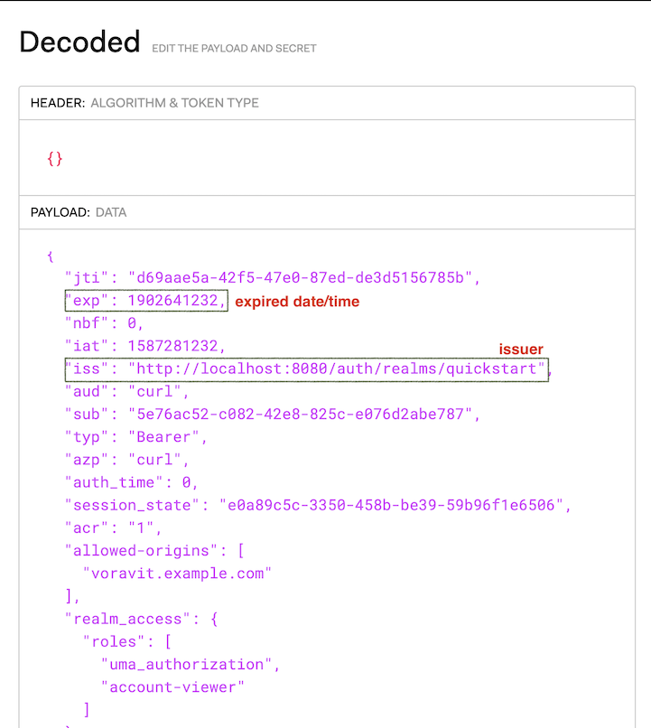

# Secure Service with JWT Authentication

Istio sidecar can validate JWT token as defined by RFC 7519. You can check more detail in OpenID connect 1.0 (OIDC) and OAuth 2.0

<!-- TOC -->

- [Secure Service with JWT Authentication](#secure-service-with-jwt-authentication)
  - [Setup](#setup)
  - [Authentication Policy](#authentication-policy)
    - [Test](#test)
  - [Clean Up](#clean-up)
  - [Next Topic](#next-topic)

<!-- /TOC -->

## Setup

Create frontend and backend application (same as previous lab) along with Istio gateway,virtual service for frontend.

We need istio gateway because we want frontend app to authenticate by JWT token.

```bash
oc delete -f ocp/frontend-route.yml -n $USERID
oc apply -f ocp/frontend-v1-deployment.yml -n $USERID
oc apply -f ocp/frontend-service.yml -n $USERID
oc apply -f ocp/backend-v1-deployment.yml -n $USERID
oc apply -f ocp/backend-v2-deployment.yml -n $USERID
oc apply -f ocp/backend-service.yml -n $USERID
oc apply -f istio-files/virtual-service-frontend.yml -n $USERID
watch oc get pods -n $USERID
oc apply -f istio-files/frontend-gateway.yml -n $USERID
```

## Authentication Policy

Review [frontend-jwt-authentication.yml](../istio-files/frontend-jwt-authentication.yml)

```yaml
spec:
  targets:
  - name: frontend
    ports:
    - number: 8080
  #If Frontend also enabled with mTLS. You need to specified peers with mtls
  #peers:
  #- mtls: {}
  origins:
  - jwt:
      issuer: "http://localhost:8080/auth/realms/quickstart"
      audiences:
      - "curl"
      jwksUri: "https://gitlab.com/workshop6/service-mesh/raw/master/keycloak/jwks.json"
      triggerRules:
      - excludedPaths:  
        - exact: /version
```

This authentication policy is configured with

* Target service is frontend
* Issuer (iss) must be http://localhost:8080/auth/realms/quickstart
* URL of the provider’s public key set to validate signature of the JWT is located at https://gitlab.com/workshop6/service-mesh/raw/master/keycloak/jwks.json

Apply authentication policy 

```bash
oc apply -f istio-files/frontend-jwt -n $USERID
```

For testing purpose, JWT token that satisfied with above requirments is genereated by Red Hat Single Sign-On (or its upstream Keycloak) and also set token validity period to 10 years (This is for simplied steps for test JWT. Normally, default validity duration of token is 1 minutes)

You can check JWT token by get content of [jwt.txt](../keycloak/jwt.txt) and decode with [jwt.io](http://jwt.io)

Another token ([jwt-wrong-realm.txt](../keycloak/jwt-wrong-realm.txt) is generated with another Issuer for testing.

Following show decoded JWT token. Check for iss that is same value as issuer in authentication policy



### Test

JWT authentication is specified in HTTP header as follow.

```bash
Authorization: Bearer <token>
```

Test with token which issue from invalid issuer.

```bash
GATEWAY_URL=$(oc get route istio-ingressgateway -n $USERID-istio-system -o jsonpath='{.spec.host}')
TOKEN=$(cat keycloak/jwt-wrong-realm.txt)
curl -v --header "Authorization: Bearer $TOKEN" $GATEWAY_URL
```

Sample output

```bash
....
< HTTP/1.1 401 Unauthorized
...
...
Origin authentication failed.* Closing connection 0
```

Test again with valid JWT token

```bash
TOKEN=$(cat keycloak/jwt.txt)
curl --header "Authorization: Bearer $TOKEN" $GATEWAY_URL
```

With valid JWT token, you will get response from Frontend app.

```bash
Frontend version: v1 => [Backend: http://backend:8080, Response: 200, Body: Backend version:v2, Response:200, Host:backend-v2-7699759f8f-8pxj8, Status:200, Message: Hello, World]
```

## Clean Up

Run oc delete command to remove Istio policy.

```bash
oc delete -f istio-files/frontend-jwt-authentication.yml -n $USERID
oc delete -f istio-files/frontend-gateway.yml -n $USERID
oc delete -f istio-files/virtual-service-frontend.yml -n $USERID
```

## Next Topic

[Rate Limits](./10-rate-limits.md)

